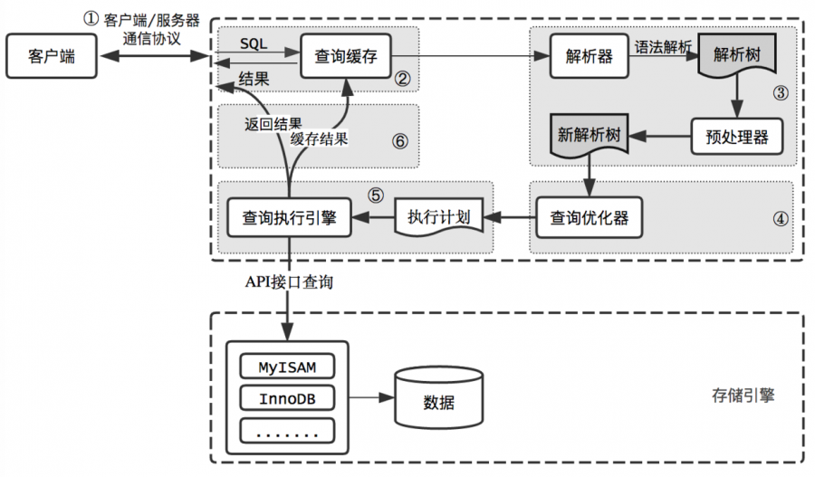

# question-db
some questions and answers for database.

#### 1. MySQL存储引擎？哪些应用使用了MyISAM引擎？
MyISAM：较快的插入、查询速度，但不支持事务，不支持外键，不支持行级锁（支持表级锁）<br>
InnoDB：MySQL默认的事务型数据库引擎，支持ACID事务，支持行级锁（默认）<br>
Memory：内存表，使用hash索引（https://blog.csdn.net/qq_25827845/article/details/90544530）<br>
Cluster/NDB（ndbcluster）：高冗余的存储引擎，用多台数据机器联合提供服务以提高整体性能和安全性，适合数据量大，安全和性能要求高的应用。<br>
绝大多数是查询的时候可以使用MyISAM

#### 2. MySQL开启慢查询日志？
slow_query_log：是否开启慢查询日志，1开启，0不开启<br>
long_query_time：慢查询阈值，默认10秒

#### 3. MySQL查看执行计划？
```sql
explain select xx from xx where xx;
```
explain结果的各个item的含义：

item | 含义
-|-
select_type | 查询中每个select字句的类型
type | 在表中找到所需行的方式，又称“访问类型”。<br>index：表示全索引扫描<br>all：表示全表扫描，性能最差<br>range：表示区间查询<br>ref, eq_ref：常量或等值查询<br>const：主键等值查询
possible_keys | 能使用哪个索引在表中找到行。<br>查询涉及到的字段如果有索引，该索引会被列出，但不一定被查询使用
key | 查询的时候实际使用的索引
key_len | 索引中使用的字节数，可以计算出查询中使用的索引的长度。<br>数字等于索引列类型的字节数，int类型4 bytes，bigint类型8 bytes。<br>字符串类型和字符集相关，char(30) UTF-8至少是90 bytes。<br>允许null，加1 byte<br>varchar，加2 bytes
ref | 上述表的连接匹配条件，即哪些列或常量被用于查找索引列上的值
rows | 预估需要检测的行数
Extra | 十分重要的额外信息，是否使用了索引，是否需要排序，是否会用到临时表。<br>using index表示覆盖索引扫描，说明性能较好。

#### 4. MySQL索引原理？索引的类型？如何合理创建索引？索引的缺点？
索引是一种数据结构，由B树或B+树实现（另外还有hash、full-text）。<br>
B树叶子节点和非叶子节点都保存数据，导致非叶子节点能保存的指针数量变少，需要保存大量数据的时候只能增加树的高度，导致I/O操作变多，查询效率低。
B+树只需要遍历叶子节点就能遍历所有值，在数据库查询中遍历元素是很常见的，解决了B树遍历元素效率低的问题。

https://cloud.tencent.com/developer/news/373193

##### 索引创建原则：
(1) 最左前缀匹配原则。MySQL会一直向右匹配直到范围查询（>、<、like、between）<br>
在B+树索引中，索引项是按照索引定义里面出现的字段顺序排序的，查找的时候找到第一个满足的记录，直接向右遍历即可。<br>
(2) =和in可以乱序。<br>
(3) 选择区分度高的列建索引。<br>
(4) 索引列不要参与计算。比如from_unixtime(create_time) = ‘2018-01-20’，无法利用索引，应写成create_time = from_unixtime(‘2018-01-20’)<br>
(5) 尽量扩展索引，不新建索引。<br>

##### 适合建索引的列：
(1) 经常需要查找的列<br>
(2) 作为主键的列<br>
(3) 经常用在连接的列，可以加快连接的速度<br>
(4) 经常需要根据范围查找的列<br>
(5) 经常需要排序的列<br>
(6) 经常用在where字句的列<br>

##### 不适合建索引的列：
(1) 只有很少数据值的列，如性别<br>
(2) 定义为text，image，bit的列<br>
(3) 更新性能要求大于检索性能要求的列

##### 索引的缺点：
(1) 插入、删除、修改、维护速度下降<br>
(2) 占用物理和数据空间

##### 索引的类型：
(1) 唯一索引。不允许任意两行的该列上有相同的值。<br>
(2) 主键索引。列定义为主键时自动创建的索引，一种特殊的唯一索引。<br>
非主键索引也叫作二级索引。<br>
主键索引存放的值是整行字段的数据，非主键索引存放的值是主键字段的值，即对非主键字段的查询，如果用了非主键字段索引，需要二次查询，系统如果根据索引基数判断出二次查询更慢，直接采用全表扫描。<br>
(3) 聚集索引。表中行的物理顺序和键值的顺序相同，和非聚集索引相比，可以提供更快的数据访问速度，一张表只能有一个聚集索引。<br>
(4) 全文索引。主要用来查找文本中的关键字，而不是直接与索引中的值比较，仅可用于MyISAM表<br>
(5) 普通索引。<br>
(6) 最左索引（组合索引）。更好的提高效率，创建索引时将最常用的放在最左边，依次递减。

```sql
CREATE TABLE `eval_table` (
  `id` int(10) NOT NULL AUTO_INCREMENT,
  `user` int(10) NOT NULL,
  PRIMARY KEY (`id`),
  KEY `user` (`user`) USING BTREE, // 指定索引类型为B树
) ENGINE=ndbcluster AUTO_INCREMENT=7345 DEFAULT CHARSET=utf8;
```

#### 5. 聚集索引（聚族索引，ClusterIndex）和非聚集索引（辅助索引，二级索引，no-cluster index）？
聚集索引：用于决定数据表中的物理存储顺序，一张表最多有一个聚集索引，字段值尽量不修改，因为修改后物理顺序需要重写排序。通常主键就是聚集索引。<br>
非聚集索引：索引的逻辑顺序与磁盘上数据行的物理存储顺序不同。关键字是index，不会决定数据的物理顺序，一张表最多可以有249个非聚集索引。<br>

非聚集索引又可分为：普通索引、唯一索引、全文索引。<br>
聚集索引查询效率高，但写入性能不高，因为需要移动数据的物理位置。<br>

MySQL中主键列就是聚集索引，不能对其他列创建聚集索引。
如果没有定义主键，则选取第一个非null唯一索引为聚集索引，如果也没有则生成一个隐藏的id列作为聚集索引。

#### 6. MySQL索引基数（区分度）？
索引中不重复的索引值的数量，基数越高索引的效果越好。
```sql
show index from table_name;
```
cardinality列中即为索引基数，是一个估计值。<br>
更新索引基数：
```sql
analyze table table_name;
```

#### 6. 事务的ACID特性？
A，atomic，原子性，事务要么提交，要么失败，不能一半成功一半失败。<br>
C，consistent，一致性，事务开始和结束后，数据的一致性约束没有被破坏。<br>
I，isolation，隔离性，并发事务之间互不干扰，互不影响。<br>
D，duration，持久性，已提交的事务对数据库做的更新必须永久保存，即使发生崩溃，也不能丢失数据或回滚。<br>

#### 8. MySQL行锁和表锁？悲观锁和乐观锁？间隙锁？next-key锁？？？
悲观锁：假定会发生冲突，屏蔽任务违反数据完成性的操作。<br>
乐观锁：假定不会发生冲突，只有在提交时检查是否违反数据完整性。<br>

乐观锁的主要两个步骤：冲突检测、数据更新。<br>
乐观锁的一项实现技术：CAS，Compare and Swap.<br>
乐观锁的ABA问题：可以通过增加递增的version字段或时间戳字段解决。<br>

InnoDB引擎的乐观锁机制是通过MVCC（Multi-Version Concurrency Control，多版本并发控制）实现，通过保存数据在某一个时间点的快照来实现。
事务的版本号？间隙锁？快照读和当前读？
https://blog.csdn.net/qq_27007251/article/details/70016787

在进行写操作时，如果过滤条件是非唯一索引，为了保证读的数据一致性，通过间隙锁对数据之间的区域进行锁定。<br>
间隙锁是为了防止幻读：<br>
(1) 防止间隙内有新数据插入<br>
(2) 防止已存在的数据，更新成间隙内的数据<br>

next-key锁包含了行锁和间隙锁，即同时锁定行和一个范围。<br>
InnoDB默认加锁方式是next-key锁。

#### 9. 数据库连接池的工作机制？

#### 10. MySQL维护常用的命令。
show processlist; # 列出所有进程<br>
Kill？？？

#### 11. MySQL有哪些日志？如何开启？如何查看？
错误日志。<br>
查询日志。<br>
慢查询日志。<br>
二进制日志。记录对数据库执行更改的所有操作。<br>
事务日志。<br>
中继日志。

redo log, bin log, undo log：<br>
- binlog<br>
MySQL服务层产生的日志，常用于数据恢复、数据库复制。MySQL主从架构就是采用slave同步master的binlog实现的，通过解析binlog也能够实现MySQL到其他数据源（如ElasticSearch）的数据复制。<br>
- redo log<br>
记录了数据在物理层面的修改，MySQL大量使用内存中的缓存，修改时直接修改缓存，而不是磁盘。当缓存和磁盘的数据不一致时，称缓存中的数据为脏页。<br>
为了保证数据的安全性，事务的在进行的过程中会不断产生redo log日志，在事务提交时进行flush，保存到磁盘中。数据库重启时，会根据redo log进行数据恢复，如果redo log中有事务提交，则进行事务提交修改数据，从而实现了事务的原子性、一致性和持久性。<br>
- undo log<br>
除了记录redo log外，在修改数据时还会记录undo log，记录了数据的反向操作，用于回撤。比如插入对应删除，修改对应修改为原来的数据。通过undo log可以实现事务的回滚，并且可以根据undo log回溯到某个特定版本的数据，实现MVCC。

#### 12. MySQL字段定义varchar(50)和int(10)，数字50和10的含义？
int(M)，M表示最大显示宽度，与存储的大小范围无关，都是4 bytes的存储空间。<br>
varchar(50)，最多存储50个字符，varchar(50)和varchar(200)存储“hello”所占空间一样，但后者在排序时会消耗更多的内存，因为order by col使用fixed_length计算col长度。<br>

#### 13. MySQL主从复制？主主复制？原因？应用场景？？实际项目经验？
主要有三个步骤：<br>
(1) master将更新记录到二进制mvccbinary log（也叫二进制mvcc事件binary log events）中<br>
(2) slave通过I/O线程将master的二进制日志拷贝到自己的中继日志<br>
(3) slave通过SQL线程重做中继日志中的事件<br>

MySQL支持的复制类型：<br>
(1) 基于语句的复制<br>
在master执行的sql语句，在slave上同样执行。MySQL默认的复制方式，效率比较高。<br>
优点：实现简单、日志量少<br>
缺点：系统当前时间戳（日志还需要包含元数据）、当前登录用户、存储过程、触发器、必须是串行化<br>
(2) 基于行的复制<br>
把改变的内容复制过去。<br>
优点：对任何语句都能正确的复制<br>
缺点：二进制日志可能很大，而且不直观<br>
(3) 混合类型的复制<br>
默认采用基于语句的复制，无法精确的复制时，改用基于行的复制。

主从复制的作用：<br>
数据分布<br>
负载均衡<br>
备份<br>
高可用性和容错行<br>

其他复制方式：<br>
一主一从<br>
主主复制（互为主从）<br>
一主多从（扩展读性能）<br>
级联复制（解决slave太多而master成为瓶颈的问题）<br>
多主一从（从5.7版本开始支持）<br>


#### 14. 事务的4种隔离级别？
(1) Read uncommitted，读未提交，最弱的隔离级别，事务中的修改即使未提交，对其他事务也是可见的，即脏读。<br>
(2) Read committed，读已提交，不可重复读，大多数据库默认的事务隔离级别。解决的脏读的问题，一个事务从开始到提交前，所做的修改对其他事务是不可见的。一个事务两次执行同样的查询，可能得到不同的结果。<br>
(3) Reatable read，可重复读，MySQL默认的隔离级别。解决了脏读，且保证了同一个事务中多次读取同样记录的结果是一致的，但无法解决幻读的问题。InnoDB和xtradb存储引擎通过多版本并发控制（MVCC, Multiversion Concurrency Control）解决了幻读的问题。<br>
(4) Serializable，可串行化，最高级别的隔离，通过强制事务串行执行，解决了幻读的问题，会在读取的每一行数据都加锁。

隔离级别 | 脏读 | 不可重复读 | 幻读
-|-|-|-
Read uncommitted | √ | √ | √
Read committed | × | √ | √
Repeatable read | × | × | √
Serializable | × | × | ×

&emsp;&emsp;不可重复读和幻读都是读取了另一条已经提交的事务，不可重复读重点在于update，幻读重点在于insert和delete。<br>
&emsp;&emsp;可重复读隔离级别，事务读取到数据后加锁，其他事务无法对这些数据进行修改，但可以insert，再次读取会多出其他数据，即幻读，不能通过行锁来避免，只能用serializable隔离级别，会降低数据库的并发能力。<br>

#### 15. InnoDB引擎如何通过日志实现事务？
事务日志是通过redo和InnoDB的日志缓冲（Innodb log buffer）来实现的。<br>
开始一个事务的时候，会记录该事务的lsn（log sequence number）号，事务执行时，往InnoDB的日志缓存写入事务日志，事务提交时，将日志缓存写入磁盘（通过innodb_flush_log_at_trx_commit来控制），也就是写数据前需要先写日志，这种方式称为“预写日志方式”。

#### 16. MySQL profile性能分析？
查看profile是否开启：
```
mysql> show variables like '%profiling%';
+------------------------+-------+
| Variable_name          | Value |
+------------------------+-------+
| profiling              | OFF   |
| profiling_history_size | 15    |
+------------------------+-------+
```
开启profile：
```
mysql> set profiling = 1;
Query OK, 0 rows affected (0.00 sec)
```
查看分析结果：
```
mysql> show profiles;
+----------+------------+----------------------+
| Query_ID | Duration   | Query                |
+----------+------------+----------------------+
|        1 | 0.00010100 | select * from basisc |
|        2 | 0.00012900 | select * from basic  |
+----------+------------+----------------------+
```
查看IO、CPU等信息：
```
mysql> show profile block io, cpu for query 2;
+--------------------+----------+----------+------------+--------------+---------------+
| Status             | Duration | CPU_user | CPU_system | Block_ops_in | Block_ops_out |
+--------------------+----------+----------+------------+--------------+---------------+
| starting           | 0.000034 | 0.000000 |   0.000000 |            0 |             0 |
| Opening tables     | 0.000008 | 0.000000 |   0.000000 |            0 |             0 |
| System lock        | 0.000002 | 0.000000 |   0.000000 |            0 |             0 |
| Table lock         | 0.000004 | 0.000000 |   0.000000 |            0 |             0 |
| init               | 0.000011 | 0.000000 |   0.000000 |            0 |             0 |
| optimizing         | 0.000002 | 0.000000 |   0.000000 |            0 |             0 |
| statistics         | 0.000006 | 0.000000 |   0.000000 |            0 |             0 |
| preparing          | 0.000004 | 0.000000 |   0.000000 |            0 |             0 |
| executing          | 0.000002 | 0.000000 |   0.000000 |            0 |             0 |
| Sending data       | 0.000041 | 0.000000 |   0.000000 |            0 |             0 |
| end                | 0.000002 | 0.000000 |   0.000000 |            0 |             0 |
| query end          | 0.000001 | 0.000000 |   0.000000 |            0 |             0 |
| freeing items      | 0.000009 | 0.000000 |   0.000000 |            0 |             0 |
| logging slow query | 0.000001 | 0.000000 |   0.000000 |            0 |             0 |
| cleaning up        | 0.000002 | 0.000000 |   0.000000 |            0 |             0 |
+--------------------+----------+----------+------------+--------------+---------------+
```

#### 17. MySQL InnoDB引擎的行锁是如何实现的？
基于索引来实现行锁。<br>
select * from table where id = 1 for update;<br>
for update可以根据条件进行行锁定，id是有索引键的列，如果id不是索引键那么innodb会进行表锁定，无法支持并发。<br>
MySQL InnoDB默认使用行级锁，行级锁基于索引，如果SQL语句用不到索引，不会使用行级锁，而是使用表锁。

#### 18. MySQL删除数据delete和truncate的区别？
项 | delete | truncate
-|-|-
类型 | DML（data maintain language） | DDL（data define language）
恢复 | 删除操作作为事务记录在日志中，可以回滚 | 删除所有数据，不记录日志，不能恢复
空间 | 不会减少表或索引所占空间 | 表和索引所占空间恢复到初始大小
触发器 | / | 不会触发触发器

#### 19. 数据库三范式？
第一范式（1NF）：关系型数据库的基本要求，表的每一列都是不可分割的基本数据项，同一列不能有多个值。第一范式就是无重复的列。<br>
第二范式（2NF）：满足第二范式必须先满足第一范式，要求数据库表中的每一行都可以被唯一区分，要求实体的属性完全依赖于主键。第二范式就是非主属性依赖于主键字。<br>
第三范式（3NF）：要求一个数据库表不包含已在其他表中包含的非主键信息。比如有一张部门表，字段有id、名称、简介，另外有一张员工表，列出了部门id后，不能再列出部门名称、简介，即消除冗余。<br>

第一范式：每列都是不可分割的原子值，所有关系型数据库都满足<br>
第二范式：每列都和主键相关<br>
第三范式：一个表中不能包含已经在其他表中存在的非主键字段，即不能冗余<br>
          非主键字段不能相互依赖？

#### 20. 存储过程（producer）和触发器（trigger）的区别？存储过程和函数（function）的区别？
(1) 存储过程可以用EXECUTE语句调用，触发器不能。<br>
(2) 触发器是一个在修改了指定数据后执行的存储过程。<br>
(3) 函数必须有返回值，存储过程没有，但是有传出参数<br>
(4) 函数注重的是结果，存储过程注重的是过程？？？<br>
(5) 函数可以在select语句直接调用，存储过程不能<br>

#### 21. 视图的数据能否删除、修改？
来自同一个基本表的行列子集视图一般是可更新的。<br>
如果视图的字段来自于集合函数、表达式，或者是多个表导出，则不能更新。

#### 22. MySQL中MyISAM和InnoDB的区别？
项 | InnoDB | MyISAM
-|-|-
事务 | 支持 | 不支持
数据存储 | 共享表空间 | 文件
锁 | 行级锁 | 表级锁
MVCC | 支持 | 不支持
外键 | 支持 | 不支持
全文索引 | 不支持 | 支持

InnoDB的四大特性：插入缓冲（insert buffer）、二次写（double write）、自适应哈希索引（ahi）、预读（read ahead）。<br>
执行select count(\*)，MyISAM更快，因为其内部维护了一个计数器，可以直接调用。

#### 23. 如何分表？如何查询？如何实现id字段多个表自增？
##### 垂直拆分
拆分列，将一张列比较多的表拆分成多张表，一般用于拆分大字段和访问频率较低的字段。<br>
优点：使行数据变小，在查询时减少读块和I/O的次数。简化表的结构，易于维护。<br>
缺点：主键冗余。事务变得复杂。<br>
##### 水平拆分
拆分行，将一张表的数据拆分成多张表存放。<br>

分表只是解决单一表数据量过大，表的数据还是在同一机器上，对提升MySQL的并发作用不大，水平拆分最好是分库。<br>
水平拆分需要考虑数据的增长速度，适用于稳定增长但历史数据不常用的场景，比如账单、日志。

#### 24. 如何分页查询？MySQL和Oracle的区别？

#### 25. Hash索引和B-Tree索引的区别？
Hash索引效率高，可以一次定位。<br>
B-Tree索引需要从根节点到枝节点，最后才能访问到叶子节点，效率较低。<br>

Hash索引的缺点：<br>
(1) 只能用于“=”、“IN”等值查询，不能用于范围查询，因为hash值没有大小关系<br>
(2) 不能用于排序，理由同上<br>
(3) 不能利用部分索引进行查询。对于组合索引，合并后计算hash值，所以不能利用部分索引。<br>
(4) 任何时候都不能避免全表扫描。<br>
(5) 在大量hash值相等的时候效率降低

#### 26. MySQL连接过程和连接状态？
&emsp;&emsp;MySQL客户端和服务端的通信是半双工的，任意时刻，要么是服务端向客户端发送数据，要么是客户端向服务端发送数据，不能同时发生。<br>
&emsp;&emsp;对于任意时刻，可以用命令show full processlist来查看连接状态。<br>
&emsp;&emsp;Sleep：线程正在等待客户端发送新的请求。<br>
&emsp;&emsp;Query：线程正在执行查询或者正在将数据发送给客户端。<br>
&emsp;&emsp;Locked：在MySQL服务器层，线程正在等待表锁。<br>
&emsp;&emsp;Sorting result：线程正在对结果集进行排序。<br>
&emsp;&emsp;Copying to tmp table [on disk]：线程正在执行查询，并将结果复制到一个临时表中。这种状态要么是在做GROUP BY，要么是文件排序操作，或者是UNION操作。如果有on disk，表示正在将一张临时放到磁盘上。<br>
&emsp;&emsp;Analyzing and statistics：线程正在收集存储引擎的统计信息，并生成查询的执行计划。<br>
&emsp;&emsp;Sending data：线程或者在多个状态之间传送数据，或者在生成结果集，或者在向客户端返回数据。<br>

连接过程：<br>
(1) 客户端发送一个查询给服务端。<br>
(2) 如果开启了查询缓存，服务端会优先检查缓存，通过一个hash值查找，如果命中且有权限，那么直接返回，完成查询，否则执行下一步。<br>
(3) 服务端进行SQL解析、预处理，再由优化器生成对应的执行计划。<br>
(4) 根据优化器生成的执行计划，调用存储引擎的API执行查询。<br>
(5) 将查询结果返回给客户端。

#### 27. MySQL查询优化？优化数据库访问？
(1) 使用explain+sql语句可以查看查询的效率。<br>
(2) Mysql使用基于成本的优化器。使用show status like “last_query_cost”可以得知mysql计算的当前查询的成本。<br>
(3) MySQL自带一种“嵌套循环”能够对大多数的查询进行优化，调整表关联的顺序。<br>

优化数据访问：关键在于减少数据访问量<br>
(1) 使用limit控制行数。<br>
(2) 多表关联，只查询需要的列。<br>
(3) 借助第三方缓存，将经常查询的结果缓存起来。<br>
(4) 如果查询需要扫描大量的数据但返回少量的行，可以使用索引覆盖扫描，把需要的行放到索引中。

(1) 对where, group by字段建立索引<br>
(2) 不用select \*，用具体的字段<br>
(3) 模糊查询只在右边加%，不要在两边都加%<br>
(4) 尽量不用in和not in，会造成全表扫描。对于连续的值，用between；对于子查询，用exists代替<br>
(5) 尽量不用or，会造成全表扫描。可以用union代替。<br>
(6) 尽量不要在where字句中对字段进行表达式操作，会造成全表扫描。<br>
(7) 尽量不要在where字句中进行null值判断，给字段设置默认值。<br>
(8) 尽量不要使用where 1 = 1的条件

#### 28. 事务的数据读问题，数据脏读、幻读和不可重复读？数据更新问题，第一类丢失更新，第二类丢失更新？

#### 29. 数据库查询left join、right join和inner join？
left：以左表为准，右表不存在的字段为null<br>
right：以右表为准，左表不存在的字段为null<br>
inner：取左右两张表都存在的字段

#### 30. 不使用框架的情况下的分页查询？
select * from table limit 300, 100;<br>
300表示起始位置，100表示查询的数量

#### 31. 数据库查询的左连接、右连接、内连接？
left join：A left join B on A.id = B.id;以左表A为准，右表没有的数据用null表示<br>
right join：A right join B on A.id = B.id;以右表B为准，左表没有的数据用null表示<br>
inner join：A inner join B on A.id = B.id;取出两张表都有的数据

#### 32. Oracle和MySQL的索引？
Oracle的索引有聚集索引、非聚集索引、唯一索引。<br>
查询时可以提高效率，但插入时需要重新排序，降低了效率。

#### 34. MySQL的union和union all的区别？
将两个查询子集进行合并，union和自动去除重复的记录，union all不去除

#### 36. MySQL大表优化方案？
##### (1) 单表优化<br>
**字段**<br>
(a) 尽量使用TINYINT、SMALLINT、 MEDIUM_INT作为整数类型而非INT，如果非负则加上UNSIGNED<br>
(b) VARCHAR的长度只分配真正需要的空间<br>
(c) 使用枚举或者整数代替字符串类型<br>
(d) 尽量使用TIMESTAMP而非DATETIME<br>
(e) 单表不要有太多字段，保持在20以内<br>
(f) 避免使用NULL字段，很难优化查询且占用额外索引空间<br>
(g) 用整型存IP<br>

**索引**<br>
(a) 有针对性的建索引，对WHERE和ORDER BY涉及的字段<br>
(b) 使用EXPLAIN检查是使用了索引还是全表扫描<br>
(c) 值分布很少的字段不适合建索引，如性别<br>
(d) 字符字段不要做主键<br>
(e) 不用外键和UNIQUE，由程序保证约束<br>
(f) 使用多列索引时注意顺序和查询条件保持一致<br>

**查询SQL**<br>
(a) 开启慢查询日志<br>
(b) 不用SELECT * <br>
(c) 避免在WHERE中使用!=、<、>，否则引擎将放弃索引进行全表扫描<br>
(d) 查询使用LIMIT分页<br>

**引擎**<br>
MyISAM适合SELECT密集型的表，InnoDB适合INSERT和UPDATE密集型的表（同个库的表可以使用不同的引擎）

**系统参数**<br>
query_cache_size：缓存MySQL的resultset，也就是一条sql语句查询的结果集<br>
key_buffer_size：索引块的缓存大小，加大能提高索引处理速度<br>
innodb_buffer_pool_size：缓存数据块和索引块的大小<br>
table_cache：用来缓存表文件，主要用于MyISAM<br>

##### (2) 读写分离
常用的优化方案，主库写从库读，一般不采用双主或多主增加复杂性。

##### (3) 缓存
(a) MySQL内部：系统参数设置<br>
(b) 数据访问层：MyBatis、Hibernate缓存<br>
(c) 应用服务层：对应用数据的缓存<br>
直写式：数据写入数据库后，同时更新缓存，保持缓存和数据库一致。效率一般，保持同步。<br>
回写式：数据需要写入数据库时，只更新缓存，然后异步批量的将缓存同步到数据库。效率较高，但可能造成不同步。<br>
(d) web层：针对web页面做缓存<br>
(e) 浏览器客户端：客户端的缓存<br>

##### (4) 表分区
在建表的时候加上分区参数，对应用是透明的。<br>
分区的好处：<br>
(a) 可以让单表存储更多的数据<br>
(b) 可以对单个分区进行维护<br>
(c) 一些查询能只落在一些分区上，提高速度<br>
(d) 分区表的数据可以分布在不同物理设备上，提高设备利用率<br>

分区的限制和缺点：<br>
(a) 一张表最多只能有1024个分区<br>
(b) 分区表无法使用外键约束<br>
(c) NULL值会使分区过滤无效<br>
(d) 所有分区必须使用相同的存储引擎<br>

适合分区的场景：<br>
(a) 数据的时间序列性比较强，可以按时间分区<br>
(b) 数据中有明显的热点，可以将热点数据单独放在一个分区<br>
```sql
CREATE TABLE members (
    firstname VARCHAR(25) NOT NULL,
    lastname VARCHAR(25) NOT NULL,
    username VARCHAR(16) NOT NULL,
    email VARCHAR(35),
    joined DATE NOT NULL
)
PARTITION BY RANGE( YEAR(joined) ) (
    PARTITION p0 VALUES LESS THAN (1960),
    PARTITION p1 VALUES LESS THAN (1970),
    PARTITION p2 VALUES LESS THAN (1980),
    PARTITION p3 VALUES LESS THAN (1990),
    PARTITION p4 VALUES LESS THAN MAXVALUE
);
```

##### (5) 垂直拆分
把一张多字段的大表按照常用字段和非常用字段进行拆分，使用主键关联。<br>
垂直拆分的优点：<br>
(a) 可以使行数据变小，一个数据块能存放更多数据，查询时减少IO次数<br>
(b) 最大化利用cache<br>
(c) 数据维护简单<br>

垂直拆分的缺点：<br>
(a) 主键冗余<br>
(b) 需要JOIN连表<br>
(c) 事务处理复杂<br>

##### (6) 水平拆分
分片：<br>
客户端代理：分片逻辑在应用端，通过修改或封装JDBC实现，比如当当的Sharding-JDBC，阿里的TDDL<br>
中间件代理：在应用和数据之间加了一个代理层，分片逻辑维护在中间件服务中，比如MyCat.

##### (7) 兼容MySQL且可水平扩展的数据库

##### (8) NoSQL
日志类、统计类、监控类的数据<br>
非结构化或弱结构化数据<br>
对事务要求不强，且无太多关联操作的数据

#### 37. MySQL的char和varchar的区别？
char固定长度，varchar长度可变。<br>
char和varchar的存储字节由具体的字符集决定。<br>
char的值长度不够时用空格代替。

#### 38. MySQL不同引擎自增ID的维护方式？插入17条记录后，删除掉15，16，17，再次插入，ID是15还是18？
如果是MyISAM引擎，ID是18。MyISAM会把自增ID的最大值记录在文件中，重启也不会丢失。<br>
如果是InnoDB，ID是15。最大ID记录在内存中，重启或者对表进行OPTIMIZE操作，都会导致最大ID丢失。

#### 39. MySQL中CHAR_LENGTH和LENGTH的区别？
CHAR_LENGTH是字符数，LENGTH是字节数。
Latin编码中这两个值是相同的，Unicode和其他编码中两个值不同。

#### 40. MySQL中BLOB和TEXT的区别？
对BLOB值进行排序和比较时区分大小写，对TEXT值不区分大小写。

#### 41. select for update会锁表还是锁行？
Oracle锁行？？？<br>
MySQL通过索引条件检索时InnoDB使用行级锁，否则使用表锁。

#### 42. MySQL查询的in和exists的区别？
```sql
select * from A where exists (select * from B where A.id = B.id); # 对A遍历，每次循环对内表查询
select * from A where A.id in (select id from B);
```

#### 43. MySQL中ENUM的用法？
ENUM是一个字符串对象，用于指定一组预定义的值：
```sql
create table tbl (sex ENUM('male', 'female'));
```

#### 44. MySQL执行update修改数据和原数据相同，是否会执行？
```
// 不更新
binlog_format = row
binlog_row_image = FULL
// 更新
binlog_format = statement
binlog_row_image = FULL
```

#### 45. MySQL查询语句？
(1) 查询第n高的工资
```sql
select distinct(salary) from employee order by salary desc limit n-1, 1;
```

#### 46. MySQL最大连接数？
16384.<br>
默认是100.

#### 47. MySQL的sql语句执行过程？
MySQL分为上层的服务层和下层的数据存储层。<br>
server层主要包括连接器、查询缓存、分析器、优化器、执行器。<br>
存储层主要用来存储和查询数据。<br>
(1) 客户端发送一条查询命令给服务端<br>
(2) 服务器先检查查询缓存，如果命中，则直接返回缓存中的结果。<br>
(3) 服务器端进行SQL解析、预处理，再由优化器生成对应的执行计划<br>
(4) 根据优化器生成的执行计划，调用存储引擎的API查询数据<br>
(5) 将结果返回给客户端

- 查询缓存<br>
通过大小写敏感的哈希查找实现，如果命中，查询不会被解析，不会生成执行计划<br>
- 语法解析器和预处理器<br>
通过关键字解析SQL，生成一棵对应的解析树。<br>
预处理器根据一些MySQL规则进一步检查解析树是否合法，然后验证权限。<br>
- 查询优化器<br>
优化器将语法树转化为执行计划，使用基于成本的优化器，尝试预测不同执行计划的成本，选择成本最小的一个。<br>
- 查询执行引擎<br>
根据执行计划给出的指令逐步执行，有大量的操作需要调用存储区引擎接口来完成。<br>
- 返回结果给客户端<br>
是一个增量、逐步返回的过程，开始生成第一条结果时，就开始向客户端逐步返回结果。服务器无需存储太多结果而消耗太多的内存，客户端也能第一时间获得返回的结果。



#### 48. MySQL如何解决CPU和磁盘速度不一致的问题？
InnoDB为了解决磁盘和CPU速度不一致的问题，在操作磁盘数据时，先将数据加载到内存中，在内存中对数据页进行操作。<br>
MySQL在启动的时候，会向内存申请一块连续的空间，命名为Buffer Pool，缓冲池，默认大小为128M。<br>
通过LRU算法将不常用的数据淘汰掉。

#### 49. 数据库中间件MyCat和Sharding-JDBC？
MyCat<br>
组织数据库的读写分离和分库分表，客户端通过它来访问下层数据库。<br>
开源的分布式数据库系统，是一个实现了MySQL协议的服务器，前端用户可以把它看做一个数据库代理，通过MySQL客户端工具和命令行访问，其后端可以用MySQL原生协议与多个MySQL服务器通信，也可以用JDBC协议与大多数主流数据库服务器通信。<br>
核心功能是分库分表，即将一个大表水平分割成多个小表，存储在后端MySQL数据库服务器中。<br>
后端支持MySQL，SQL Server，Oracle，DB2，PostgreSQL。<br>

Sharding-JDBC<br>
数据库水平分片框架，实现透明化数据库分库分表访问。<br>
Sharding-JDBC直接封装JDBC API，可以理解为增强版的JDBC驱动，旧代码迁移成为几乎为零。<br>
定位为轻量级Java框架，使用客户端直连数据库，以jar包形式提供服务，无proxy代理层，无须额外部署，无其他依赖。<br>
分片策略灵活，支持等号、between、in等多维度分片，也可支持多分片键。

#### 50. MySQL查看事务隔离级别、查看行锁
查看事务隔离级别
```sql
mysql> select @@tx_isolation;
+-----------------+
| @@tx_isolation  |
+-----------------+
| REPEATABLE-READ |
+-----------------+
1 row in set (0.00 sec)
```
查看行锁
```sql
mysql> show status like '%innodb_row_lock%';
+-------------------------------+-------+
| Variable_name                 | Value |
+-------------------------------+-------+
| Innodb_row_lock_current_waits | 0     |
| Innodb_row_lock_time          | 8928  |
| Innodb_row_lock_time_avg      | 0     |
| Innodb_row_lock_time_max      | 36    |
| Innodb_row_lock_waits         | 19247 |
+-------------------------------+-------+
5 rows in set (0.00 sec)
```
查看引擎状态，检测最近一次死锁和当前的事务
```sql
mysql> show engine innodb status;
```
查看超时参数
```sql
mysql> show variables like '%wait_timeout%';
+--------------------------+----------+
| Variable_name            | Value    |
+--------------------------+----------+
| innodb_lock_wait_timeout | 50       |
| lock_wait_timeout        | 31536000 |
| wait_timeout             | 28800    |
+--------------------------+----------+
3 rows in set (0.00 sec)
```
查看事务是否自动提交
```sql
mysql> select @@autocommit;
+--------------+
| @@autocommit |
+--------------+
|            1 |
+--------------+
1 row in set (0.00 sec)
```

查看锁表
```sql
mysql> select * from information_schema.innodb_locks;
```

#### 51. Oracle查看触发器
```sql
SELECT NAME
FROM USER_SOURCE
WHERE TYPE='TRIGGER'
GROUP BY NAME
```

#### 52. Oracle数值类型字段
- NUMBER
- INTEGER
- BINARY_FLOAT
- BINARY_DOUBLE

#### 53. MySQL分布式方案？
- MyCAT<br>
分库分表中间件<br>
- HAProxy<br>
提供高可用、负载代理，以及基于TCP和HTTP应用的代理<br>
- Keepalived<br>
双机热备高可用，解决单点故障<br>

#### 54. MySQL表分区？
把一个数据表的文件和索引分散存储在不同物理文件中，支持的类型有：<br>
Range：基于一个给定连续区间的列值，把多行分配给分区<br>
List：类似于Range，区别在于List分区是基于列值匹配一个离散值集合中的某个值来进行选择<br>
Hash：基于用户定义的表达式的返回值来进行选择的分区<br>
Key：类似于Hash，区别在于Key分区只支持计算一列或多列<br>

#### 55. Oracle的事务隔离级别？
有两种：
read committed：读已提交（默认）
serializable：串行读

#### 56. MySQL列值为null的时候索引是否生效？

#### 100. question 100
