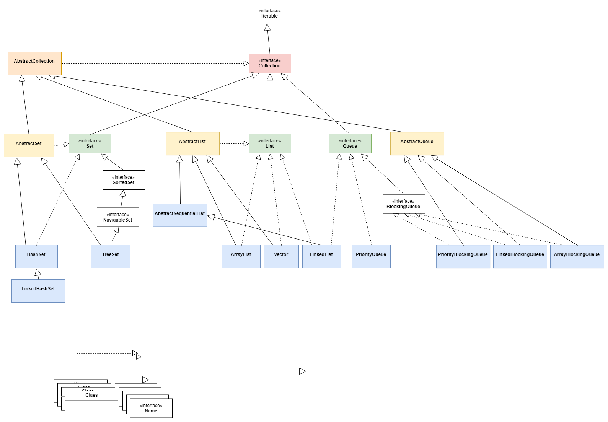
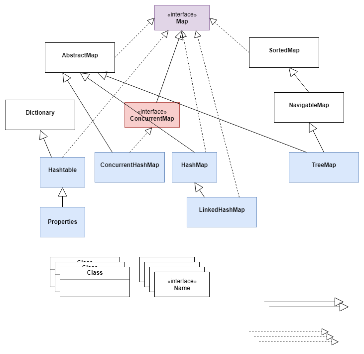

# question-java-collection
some questions and answers for Java Collection.

#### 1. Iterator和ListIterator？code
Iterator可以遍历Set和List集合，ListIterator只能遍历List集合。 
Iterator只能向前遍历，ListIterator可以双向遍历。 
ListIterator实现了Iterator接口，并包含其他功能，比如增加元素、替换元素、获取前一个和后一个元素的索引。 

#### 2. 为什么集合类没有实现Cloneable和Serializable接口？
&emsp;&emsp;克隆(cloning)或者是序列化(serialization)的语义和含义是跟具体的实现相关的。因此，应该由集合类的具体实现来决定如何被克隆或者是序列化。 
&emsp;&emsp;Collection接口指定一组对象，对象即是它的元素，如何维护这些元素由Collection的具体实现决定，比如List的元素允许重复而Set不允许。Collection只是一个抽象表现。 
&emsp;&emsp;涉及到具体实现时，clone和serialize的语义和含义才发挥作用。 

#### 3. HashMap、Hashtable和ConcurrentHashMap的区别？ConcurrentHashMap能否完全替代Hashtable？HashMap为什么是线程不安全的？
HashMap |	Hashtable |	ConcurrentHashMap
-| - | -
非线程安全 |	线程安全 | 线程安全
/ | 实现基于锁 |	锁分段
key和value允许为null | key和value不允许为null | /

HashMap和TreeMap的区别？

HashMap |	TreeMap
-|-
无序 | 有序
适用于插入、删除、定位 |	适用于有序的遍历
JDK 1.7：Entry<K, V>数据 JDK 1.8：数组+链表（链表的长度达到一个阀值8后转化为红黑树） |	红黑树

不能完全替代。Hashtable的迭代器是强一致性的，ConcurrentHashMap是弱一致性的。 
弱一致性是指在ConcurrentHashMap中put一个元素，对get不是立即可见的，为了提升效率，效率和一致性的权衡。 

多线程环境下扩容会导致Node链表形成环形结构，next节点永远不为空，导致死循环。 
初始容量为16，插入时如果容量不如需要扩容，整个hash表都需要重新计算，计算的时候会导致链表逆序，多线程的时候就可能导致在逆序的时候形成环形。

#### 4. Comparable和Comparator接口
Comparable接口 | Comparator接口
-|-
compareTo(Object o)方法，和this比较，返回负数，0，正数来表示输入对象小于，等于，大于已存在的对象 | compare(Object o1, Object o2)方法和equals()方法，comparator对象作为参数，和当前comparator的排序相同的时候返回true
用于定义对象的自然顺序 | 用于定义用户定制的顺序

#### 5. HashSet和TreeSet？HashSet如何检查重复？
HashSet | TreeSet
-| -
由hash表实现（内部使用HashMap实现） | 由树形结构实现（红黑树？）
无序 | 有序，维持了插入顺序
添加，删除，查找的时间复杂度是O(1) | 添加，删除，查找的时间复杂度是O(log(n))

将元素加入HashSet时，先计算hashCode判断加入的位置，同时与集合中已存在的元素的hashCode做比较，没有相同则没有重复，如果有相同再调用equals()判断hashCode相等的两个元素是否真的相同，是则不加入。

#### 6. 可以随机访问的集合类？线程安全的集合类？
随机访问：ArrayList、HashMap、TreeMap、Hashtable 
线程安全：Vector、Hashtable、ConcurrentHashMap、Stack、Properties

#### 7. Collection和Collections的区别？
Collection | Collections
-|-
接口 | 工具类，提供了很多静态方法

#### 8. 创建只读的集合、同步的集合？
Collections.unmodifiableCollection(Collection c); 
Collections.synchronizedCollection(Collection c);

#### 9. 遍历ArrayList时删除一个元素，什么时候会抛出ConcurrentModificationException？code
直接调用ArrayList的remove方法，导致内部维护的modCount(修改次数)和expectedModCount(预期修改次数)不等，抛出异常。 
调用Iterator的remove方法不会抛出异常，有一步设置expectedModCount = modCount。 
只有两个元素，删除任一不会报异常。内部维护一个cursor的变量，指向下一个元素，删除一个元素后，cursor == size，hasNext()为false，循环结束，不会执行到检查modCount == expectedModCount. 
for(Object obj : list)循环等价于Iterator，也会抛出异常。for(int i = 0; i < list.size(); i++)循环不依赖于Iterator，不会抛出异常。 

#### 10. 哈希表中处理冲突的方法？
线性探测、二次哈希、链接。 
线性探测：如果桶已经被占据了，则线性的查找下一个桶，直到找到一个空位 
链接：多个元素可以存储在同一个桶中

#### 11. synchronized和java.util.concurrent.locks.Lock的区别？
Lock能完成synchronized的所有功能。 
Lock有更精确的线程语义和更好的性能。 
synchronized自动释放锁，Lock需要程序手动释放，且必须在finally中释放。 
Lock为读和写分别提供了锁。 
Lock接口可以尝试非阻塞的获取锁，在指定的时间内无法获取，则返回。

#### 12. ArrayList和Vector的区别？
ArrayList | Vector
-|-
相同点 | 都是基于索引，内部有一个数组支持 有序的集合，允许重复 迭代器都是fail-fast的 都继承自AbstractList
非线程安全 | 线程安全
每次扩容为1.5倍 | 每次扩容为2倍

Vector可以看做是线程安全版的ArrayList。 
#### Array和ArrayList的区别？什么时候用Array而不是ArrayList？
Array | ArrayList
-|-
可以包含基本类型和对象类型 | 只能包含对象类型
大小固定 | 大小动态变化

处理基本数据类型的时候应该使用Array。 
#### ArrayList和LinkedList的区别？源码？？？
ArrayList | LinkedList
-|-
数组，允许元素为null | 双向循环链表，允许元素为null
随机访问快，增删慢 | 随机访问慢，增删快
/ | 根据下标访问的时候会判断在前半段还是后半段，决定顺序遍历还是逆序

#### 13. 如何去除Vector、ArrayList、LinkedList中重复的元素？code
使用HashSet，将数组的实例作为参数传入HashSet的构造函数中。 
HashSet内部维护了一个HashMap，将集合作为构造函数的参数时，会调用HashMap的put方法，通过hash值检查是否重复。

#### 14. synchronized和ReentrantLock的区别？为什么要设计可重入锁ReentrantLock？？？
重入性：同一个线程多次试图获取它占有的锁，都会成功。相应的，释放锁时，重入计数为零才释放成功。

项 | synchronized | ReentrantLock
-| - | -
/ | 阻塞式 | 阻塞式
/ | Java的关键字，原生语法层面的互斥，需要jvm实现 | JDK 1.5之后提供的API层面的互斥锁
API | 可修饰方法和代码块 | 只可修饰方法
公平锁 | 非公平锁 | 默认也是非公平锁，可通过布尔值参数的构造函数使用公平锁
自动释放 | 执行完同步块的代码后自动释放锁 | 需要手动lock和unlock，配合try/finally
释放顺序 | 释放锁的顺序必须和获得锁的顺序相反 | 释放锁的顺序自由
可中断 | 不能中断 | 可中断
可重入 | 可重入 | 可重入

#### 15. 使用Collections的最佳实践？
(1) 使用正确的集合类，比如不需要同步列表时，使用ArrayList而不是Vector。 
(2) 优先使用并发集合，而不是对集合进行同步。 
(3) 使用接口代表和访问集合，比如用List存储ArrayList，用Map存储HashMap。 
(4) 使用迭代器循环集合。 
(5) 使用泛型，类型安全、可读性、健壮性，避免运行时的ClassCastException。 
(6) 元素个数固定且事先知道，应该用Array而不是ArrayList。 
(7) 指定容器初始容量，避免重新计算hash或者扩容。 
(8) 使用JKD的不变类（immutable class）作为Map的key值，避免自己定义的类去实现hashCode()和equals()方法。 
(9) 容器为空的时候返回长度是0的集合或者数组，不要返回null。

#### 16. Java同步集合和并发集合的区别？
&emsp;&emsp;都能实现线程安全，区别在于性能和可扩展性，还有实现线程安全的方法。 
&emsp;&emsp;同步集合有：HashMap、Hashtable、HashSet、Vector、ArrayList 
&emsp;&emsp;并发集合有：ConcurrentHashMap、CopyOnWriteArrayList、CopyOnWriteHashSet 
&emsp;&emsp;同步集合会把整个List或Map锁起来，而并发集合使用了较先进的技术，如锁分离，比如ConcurrentHashMap把Map分成几个片段，只对几个加锁，允许其他线层访问未加锁的片段。 
&emsp;&emsp;CopyOnWriteArrayList允许多个线程以非同步的方式读，有线程需要写的时候复制一个副本。 
&emsp;&emsp;在读多写少的情况下使用并发集合比同步集合能获得更好的性能。

#### 17. Hashtable的size()方法只有一条语句”return count”，为什么还需要同步？
1) 同一时间只能有一个线程执行类的同步方法，但可以有多个线程执行类的非同步方法。Hashtable的put和size方法可能冲突。对size()方法同步确保在put()方法执行完成后调用，得到正确的个数 
2) Java代码只有一行，编译后的字节码也只有一行，但CPU执行的机器码可能有多行，可能执行完一行CPU就切换了。

#### 18. Java的fail-fast机制？fail-safe机制？
&emsp;&emsp;Java集合（Collection）中的一种错误机制。当多个线程对同一个集合中的内容进行操作时，就可能引发fail-fast事件。 
&emsp;&emsp;比如线程A通过iterator去遍历集合时，集合的内容被其他线程改变了，会抛出ConcurrentModificationException，产生fail-fast事件。 
&emsp;&emsp;集合中保存了一个modCount变量，即修改次数，每次对集合的修改会增加这个计数。迭代器初始化的时候将这个值赋给迭代器的expectedModCount，迭代的时候判断modCount和expectedModCount是否相等，不等则表明有其他线程修改了集合。 
&emsp;&emsp;fail-safe，安全失败，迭代的时候会在底层对集合做一个拷贝，修改上层集合不会有影响，不会抛出ConcurrentModficationException。java.util.concurrent包下的集合都是安全失败的。

#### 19. 有序的Map实现类？怎样保证有序？
TreeMap和LinkedHashMap是有序的，TreeMap默认升序，LinkedHashMap记录了插入的顺序。 
TreeMap基于红黑树实现，有序。 
LinkedHashMap，HashMap和双向链表LinkedList的结合，将所有Entry节点链入一个双向链表，用于保证插入的顺序。 

#### 20. HashMap实现原理？
&emsp;&emsp;Java中最常用的两种数据结构是数组和模拟引用（指针），几乎所有的数据结构都可以用这两种组合来实现。 
&emsp;&emsp;HashMap是一种散列链表，有一个数组，数组中的每一个元素都是一个链表，链表中的每一个元素都是entry。 
&emsp;&emsp;调用put(key, value)存储元素时，对key调用hashCode()方法，返回的hashCode用于找到bucket位置，存储entry对象。 
&emsp;&emsp;两个key的hashCode相同时，bucket位置相同，会发生碰撞，这个包含有键值对的Map.Entry对象会存储在链表中。调用get()方法的时候，如果hashCode相同，找到bucket位置后会调用key.equals()方法在链表中找到正确的节点。 
&emsp;&emsp;有几个重要特性，容量（capacity，默认值为16）、负载因子（load factor，默认值为0.75）、扩容极限（threshold resizing），元素个数大于capacity*load factor的时候会扩容为2n。

#### 21. AQS队列同步器？
全称是AbstractQueuedSychronizer，抽象队列同步器。 
如果说CAS是java.util.concurrent的基础，那么AQS则是整个并法包的核心。 
ReentrantLock、CountDownLatch、Semaphore等都用到了AQS。 
以双向队列的形式连接所有的Entry，比如ReentrantLock，所有等待线程都放在一个Entry中并连成双向队列，前一个线程使用完ReentrantLock，则双向队列实际上的第一个Entry开始执行。 
AQS定义了对双向队列的所有操作，只开放了tryLock和tryRelease给开发者重写。

#### 22. Set集合通过什么方法来判断元素相同？equals还是==？源码？
将元素作为HashMap的key，借助HashMap的key不能重复来判断。

#### 23. ConcurrentHashMap的并发度是什么？实现原理？
&emsp;&emsp;ConcurrentHashMap把map分成若干部分来实现可扩展性和线程安全，这种划分是使用并发度获得的，是构造函数的一个可选参数，默认值是16。 
&emsp;&emsp;将一个map分为多个Hashtable，根据key.hashCode()决定将key放到哪个Hashtable中。 
&emsp;&emsp;JDK 1.8中不再使用segment锁分离，而是使用乐观锁CAS算法来实现同步。底层还是数据+链表->红黑树。不需要对segment或者全局加锁，只需对单行加锁（hashCode相同）。对单个值的修改使用CAS。

#### 24. 阻塞队列BlockingQueue的作用？
java.util.concurrent.BlockingQueue的特性是：队列是空的时，获取或删除元素的操作会被阻塞，队列是满的时，添加元素的操作会被阻塞。 
不接受空值，添加空值时会抛出NullPointerException。 
线程安全，所有的查询方法都是原子的。 
主要用于实现生产-消费模型。 

JDK7提供了7个阻塞队列：
- ArrayBlockingQueue：由数组结构组成的有界阻塞队列
- LinkedBlockingQueue：由链表结构组成的有界阻塞队列
- PriorityBlockingQueue：支持优先级排序的无界阻塞队列
- DelayQueue：使用优先级队列实现的无界阻塞队列
- SynchronousQueue：不存储元素的阻塞队列
- LinkedTransferQueue：由链表结构组成的无界阻塞队列
- LinkedBlockingDeque：由链表结构组成的双向阻塞队列

#### 25. ArrayBlockingQueue的原理和应用？
实现了BlockingQueue接口。 
一个基于数组实现的阻塞队列，构造需要指定容量。当试图向满队列添加元素或从空队列删除元素时，当前线程会被阻塞。

#### 26. WeakHashMap的工作原理？
和HashMap类似，但是使用弱引用作为key，当key对象没有任何引用时，key/value会被回收。

#### 27. 什么是优先级队列（PriorityQueue）？源码？？？code
基于优先级堆的无界队列，元素按照自然顺序排序。 
在创建的时候可以传入一个给元素排序的比较器，不允许null值，因为null没有自然顺序，没有任务相关联的比较器。 
PriorityQueue不是线程安全的（类似的PriorityBlockingQueue是线程安全的），入队和出队的时间复杂度是O(log(n))。 
构造最大值堆或最小值堆的过程：先按照顺序生成一个满二叉树，再对节点siftDown或siftUp。

#### 28. 什么是优先级堆？
最小值堆或最大值堆，是一棵满二叉树（近似完全二叉树），所有父节点的值都大于（或小于）其子节点的值

#### 29. Enumeration接口和Iterator接口的区别？code？？？
Enumeration | Iterator
-|-
速度是Iterator的2倍 | /
占用更少的内存 | /
/ | 安全，其他线程不能修改正在被iterator遍历的集合
/ | 允许删除集合的元素

#### 30. hashCode()和equals()方法对于集合的作用？
&emsp;&emsp;根据Java规范，equals()判断相等的两个对象，必须有相同的hashCode。 
&emsp;&emsp;将对象放入集合的时候，先判断对象的hashCode在集合中是否已存在，不存在则直接放入，存在（hashCode相等，equals()不一定相等）则判断equals()方法和集合中的其他对象是否相等，都不相等则放入，否则不放入。

#### 31. LinkedHashMap和PriorityQueue的区别？
PriortyQueue是优先级队列，保证优先级最高或最低的元素在队头。 
LinkedHashMap维护的是元素插入的顺序。

#### 32.HashMap通过for循环remove为什么会报ConcurrentModificationException？
HashMap中有modCount和expectedModCount的比较，for循环删除没有对modCount进行更新，导致expectedModCount == modCount不成立，抛出异常。 
Iterator在remove时实现了对modCount的同步，所以不会抛出异常。

#### 33. HashMap的容量为什么是2的幂？
key值计算得到的hash大于容量，可以通过求余得到插入的数组位置，但求余运算较慢。 
通过(n-1)&hash，其中n是容量，n-1是低位全1的二进制，与运算后hash的高位全部为0，保证结果小于n。

#### 34. Java集合stream的聚合操作？code

#### 35. Java集合类图？

  

#### 100. question 100.
