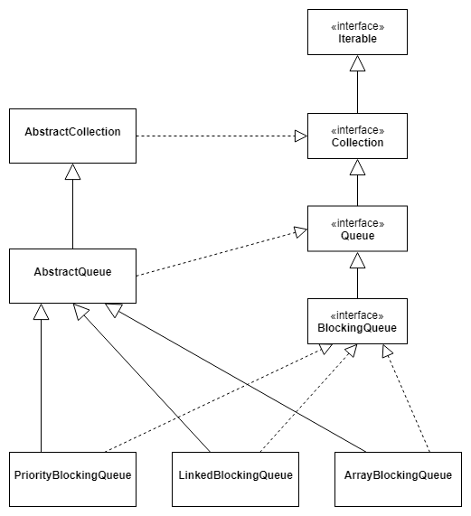
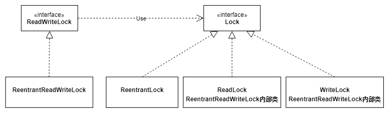

# question-java-source-code
some questions and answers for Java source code.

#### 1. BlockingQueue


#### 2. Collection和Collections

#### 3. InputStream、OutputStream、Reader、Writer

#### 4. String，substring()方法，不同版本的区别（1.6和1.7）

#### 5. Properties

#### 6. Queue和Stack

#### 7. WeakHashMap

#### 8. Runtime

#### 9. TreeList（Apache）

#### 10. Arrays（copyOf方法）

#### 11. BigInteger，如何使用位运算实现算数运算

#### 12. Hibernate，缓存，getCurrentSession()，ThreadLocal使用

#### 13. ConcurrentHashMap（Java 8）

#### 14. CopyOnWriteArrayList
volatile修饰的数组，写入后对其他线程立即可见。
```java
public class CopyOnWriteArrayList<E> implements List<E>, RandomAccess, Cloneable, java.io.serializable {
    final transient ReentrantLock lock = new ReentrantLock();
    private transient volatile Object[] array;
    public boolean add(E e) {
        final ReentrantLock lock = this.lock;
        lock.lock();
        try {
            Object[] elements = getArray();
            int len = elements.length;
            Object[] newElements = Arrays.copyOf(elements, len + 1); // 复制原来的数组
            newElements[len] = e;
            setArray(newElements); // 设置array变量，该变量用volatile修饰，对其他线程可见
            return true;
        } finally {
            lock.unlock();
        }
    }
}
```

#### 15. Spring，getBean()方法如何实现单例

#### 16. ArrayList，ConcurrentModificationException异常

#### 17. ThreadLocal

#### 18. Integer IntegerCache
```java
public final class Integer extends Number implements Comparable<Integer> {
    private static class IntegerCache { // 静态内部类
        static final int low = -128;
        static final int high;
        static {
            int h = 127;
        }
    }
}

```

#### 19. Iterator

#### 20. Comparable和Comparator
```java
public interface Comparable<T> {
    public int compareTo(T o);
}
```
```java
@FunctionalInterface
public interface Comparator<T> {
    int compare(T o1, T o2);
    boolean equals(Object obj);

}
```
Comparable是排序接口，一个类实现了Comparable接口，意味着该类支持排序。
Comparator是比较器，如果需要控制某个类的顺序，可以建立一个该类的比较器来排序。
Comparable相当于内部比较器，Comparator相当于外部比较器。

#### 21. MyBatis设计模式
Builder模式
```java
public class SqlSessionFactoryBuilder {
    // build方法1
    public SqlSessionFactory build(Reader reader) {
        return this.build(reader, (String)null, (Properties)null);
    }
    // build方法2
    public SqlSessionFactory build(Reader reader, String environment, Properties props) {
        SqlSessionFactory var6;
        try {
            XMLConfigBuilder parser = new XMLConfigBuilder(reader, environment, props);
            Configuration config = parser.parse();
            var6 = this.build(config);
        } catch (Exception var15) {
            throw ExceptionFactory.wrapException("Error building SqlSession.", var15);
        } finally {
            ErrorContext.instance().reset();
            try {
                reader.close();
            } catch (IOException var14) {
                // 捕获之后不做任何处理？？？
            }
        }
    }
    // build方法3
    public SqlSessionFactory build(Configuration config) {
        return new DefaultSqlSessionFactory(config);
    }
}
```
```java
public class XMLConfigBuilder extends BaseBuilder {
    private boolean parsed; // 记录是否解析过，只能解析一次
    // 解析得到Configuration对象
    public Configuration parse() {
        if (this.parsed) {
            throw new BuilderException("each MapperConfigParser can only be used once.")
        } else {
            this.parsed = true;
            this.parseConfiguration(this.parser.evalNode("/configuration")); // 根节点是configuration
        }
    }
    // 解析配置文件的第一级节点
    private void parseConfiguration(XNode root) {
        try {
            // 依次解析xml配置文件的第一层节点，因此第一层配置项需要注意顺序
            this.typeAliasesElement(root.evalNode("typeAliases"));
            this.pluginElement(root.evalNode("plugins"));
            /**
            objectFactory
            objectWraperFactory
            properties
            settings
            environments
            typeHandlers
            **/
            this.mapperElement(root.evalNode("mappers"))
        } catch (Exception var3) {
            throw new BuilderException("errpr parsing sql mapper configuration");
        }
    }
}
```
工厂模式
```java
public class DefaultSqlSessionFactory implements SqlSessionFactory {
    private SqlSession openSessionFromDataSource(ExecutorType execType, TransactionIsolationLevel level, boolean autoCommit) {
        DefaultSqlSession var10;
        try {
            Environment environment = this.configuration.getEnvironment();
            DataSource dataSource = this.getDataSourceFromEnvironment(environment);
            TransactionFactory transactionFactory = this.getTransactionFactoryFromEnvironment(environment);
            Connection connection = dataSource.getConnection();
            if (level != null) { // 设置隔离级别
                connnection.setTransactionIsolation(level.getLevel());
            }
            connection = this.wrapConnection(connection);
            Transaction tx = transactionFactory.newTransaction(connection, autoCommit);
            Executor executor = this.configuration.newExecutor(tx, execType);
            var10 = new DefaultSqlSession(this.configuration, executor, autoCommit);
        } catch (SQLException var14) {
            throw ExceptionFactory.wrapException("error opening session, cause:", var14);
        } finally {
            ErrorContext.instance().reset();
        }
        return var10;
    }
}
```
单例模式
```java
public class ErrorContext {
    private static final ThreadLocal<ErrorContext> LOCAL = new ThreadLocal(); // 将实例保存到ThreadLocal中
    private ErrorContext() {} // 私有的构造方法
    public static ErrorContext instance() {
        ErrorContext context = (ErrorContext)LOCAL.get();
        if (context == null) {
            context = new ErrorContext();
            LOCAL.set(context);
        }
        return context;
    }
}
```
代理模式
```java
public class MapperRegistry {
    private Set<Class> knownMappers = new HashSet<>();
    public <T> T getMapper(Class<T> type, SqlSession sqlSession) {
        if (!this.knownMappers.contains(type)) {
            throw new BindingException("Type" + type + "is not known to MapperRegistry");
        } else {
            try {
                return MapperProxy.newMapperProxy(type, sqlSession);
            } catch (Exception var4) {
                throw new BindingException("Error getting mapper instance, casuse:" + var4, var4);
            }
        }
    }
}
```
```java
public class MapperProxy implements InvocationHandler {
    private static final Set<String> OBJECT_METHODS = new HashSet<String>() {
        {
            this.add("toString");
            this.add("getClass");
            this.add("equals");
            this.add("hashCode");
            this.add("wait");
            this.add("notify");
            this.add("notifyAll");
        }
    };

    public static <T> T new MapperProxy(Class<T> mapperInterface, SqlSession sqlSession) {
        ClassLoader classLoader = mapperInterface.getClassLoader();
        Class[] interfaces = new Class[]{mapperInterface};
        MapperProxy mapperProxy = new MapperProxy(sqlSession);
        return Proxy.newProxyInstance(classLoader, interfaces, mapperProxy);
    }

    @Override
    public Object invoke(Object proxy, Method method, Object[] args) throws Throwable {
        try {
            if (!OBJECT_METHODS.contains(method.getName())) {
                Class declaringInterface = this.findDeclaringInterface(proxy, method);
                MapperMethod mapperMethod = new MapperMethod(declaringInterface, method, this.sqlSession);
                Object result = mapperMethod.execute(args);
                if (result == null && method.getReturnType().isPrimitive()) {
                    throw new BindingException();
                }
                return result;
            }
        } catch (SqlException var7) {
            var7.printStackTrace();
        }
    }
    private Class findDeclaringInterface(Object proxy, Method method) {
        //
    }
}
```
```java
public class MapperMethod {
    //
}
```
组合模式（动态sql）
```java
public interface SqlNode {
    boolean apply(DynamicContext var1);
}
public class ChooseSqlNode implements SqlNode {}
public class ForEachSqlNode implements SqlNode {}
public class IfSqlNode implements SqlNode {}
public class MixedSqlNode implements SqlNode {}
public class SetSqlNode implements SqlNode {}
public class TextSqlNode implements SqlNode {}
public class TrimSqlNode implements SqlNode {}
public class WhereSqlNode implements SqlNode {}
```
模板方法模式<br>
适配器模式（日志）
```java
public interface Log {
    boolean isDebugEnabled();
    void error(String var1, Throwable var2);
    void error(String var1);
    void debug(String var1);
    void warn(String var1);
}
```
```java
public class Log4jImpl implements Log {
    private Logger log;
    public Log4jImpl(Class clazz) {
        this.log = Logger.getLogger(clazz);
    }
    public boolean isDebugEnabled() {
        return this.log.isDebugEnabled();
    }
}
```
装饰器模式<br>
迭代器模式

#### 22. Lock, ReentrantLock,
```java
public interface Lock {
    void lock();
    void lockInterruptibly() throws InterruputedException;
    boolean tryLock();
    boolean tryLock(long time, TimeUnit unit) throws InterruptedException;
    void unlock();
    Condition newCondition();
}
```
```java
public class ReentrantLock implements Lock, Serializable {
    private final ReentrantLock.Sync sync;
    public ReentrantLock() {
        this.sync = new ReentrantLock.NonfairSync(); // 默认的是非公平锁
    }
    public ReentrantLock(boolean var1) { // 重载构造函数，可传入参数指定公平/非公平
        this.sync = (ReentrantLock.Sync)(var1 ? new ReentrantLock.FairSync() : new ReentrantLock.NonfairSync());
    }
    abstract static class Sync extends AbstractQueuedSynchronizer {}
    static final class FairSync extends ReentrantLock.Sync {}
    static final class NonfairSync extends ReentrantLock.Sync {}
}
```


#### 23. AbstractQueuedSynchronizer，抽象队列同步器（应用：CountDownLatch, Semephore, ThreadPoolExecutor, ReentrantLock, ReentrantReadWriteLock）
```java
public abstract class AbstractQueuedSynchronizer extends AbstractOwnableSynchronizer implements java.io.Serializable {}
```

#### 24. ThreadPoolExecutor


#### 100.
