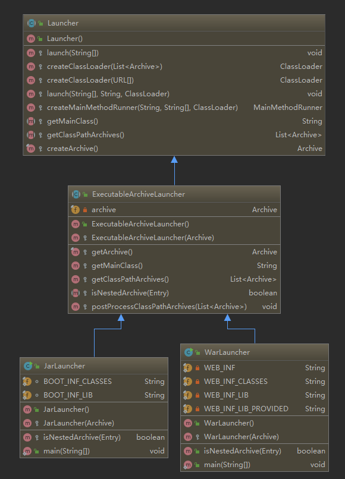

# question-java-spring-boot
some questions and answers for Spring Boot.

#### 1. Spring Boot有哪些优点？
(1) 减少开发、测试的时间<br>
(2) 使用JavaConfig，避免使用XML<br>
(3) 避免大量的Maven导入和版本冲突<br>
(4) 提供默认配置快速开始开发<br>
(5) 不需要单独的web服务器<br>
(6) 需要更少的配置，没有web.xml文件。只需添加@Configuration的类，添加@Bean注释的方法<br>
(7) 基于环境的配置<br>

#### 2. 如何理解Spring Boot的“约定大于配置”？是如何实现的？（question-006 源码）
(1) 开发人员仅需规定应用中不符合约定的部分<br>
(2) 在没有规定配置的地方，采用默认配置，以力求最简配置为核心<br>

有以下约定：<br>
Maven的目录结构，src-main-java源代码, src-main-resource资源配置文件, target编译结果<br>
Spring Boot的配置文件，application.properties/yml<br>
application配置文件的默认属性，比如数据库连接spring:datasource<br>

实现：<br>
核心注解@SpringBootApplication = @SpringBootConfiguration + @EnableAutoConfiguration + @ComponentScan <br>
@EnableAutoConfiguration引入了@AutoConfigurationImportSelector，selectImports方法，调用getCandidateConfigurations方法，读取工程项目下的jar包的META-INF/spring.factories文件，加载相关的bean到IOC容器

#### 2. Spring Cloud和Spring Boot的关系？
Spring Cloud是分布式微服务架构下的一站式解决方案，是各个微服务架构落地技术的集合体，俗称微服务栈解决方案。<br>
Spring Cloud是宏观的概念，Spring Boot是具体的技术。<br>
Spring Boot专注于快速、方便集成的单个个体。<br>
Spring Cloud是关注全局的微服务协调整理治理框架，它将Spring Boot开发的多个单体微服务整合并管理起来，为各个服务之间提供配置管理、服务发现、断路器、路由、微代理、事件总线、全局锁、决策竞选、分布式会话等集成服务。

#### 3. 如何不重启服务器而重新加载Spring Boot的更改？
使用DEV工具，DevTools模块。
```xml
<dependency>  
  <groupId>org.springframework.boot</groupId>    
  <artifactId>spring-boot-devtools</artifactId>  
  <optional>true</optional>
</dependency>
```
如果使用idea，需要以下配置：<br>
(1) File-Settings-Compiler-Build Project automatically<br>
(2) ctrl + shift + alt + / 选择Registry,勾上 Compiler autoMake allow when app running

#### 4. Spring Boot的监视器是什么？
Spring Boot Actuator，可以访问生产环境中正在运行的应用的状态。
```xml
<dependency>
    <groupId>org.springframework.boot</groupId>
    <artifactId>spring-boot-starter-actuator</artifactId>
</dependency>
```
```
management:
    endpoints:
        web:
            exposure:
                include: "*"
```
/health<br>
/conditions<br>
/configprops<br>
/beans<br>
/heapdump<br>
/threaddump<br>
/env<br>

#### 5. 什么是YAML？
Yet another Markup Language，一种人类可读的数据序列化语言，常用于配置文件。<br>
能够分层配置，更加架构化，更少混淆。

#### 6. Spring Boot的@SpringBootApplication注解？
一个复合的注解，将三个组合在一起。<br>
SpringBoot根据应用的依赖、自定义的bean、classpath的类识别需要的bean。
```java
@SpringBootConfiguration // Spring框架的注解，标明该类是JavaConfig配置类，用来代替applicationContext.xml配置文件
@EnableAutoConfiguration // 开启SpringBoot自动配置功能
@ComponentScan // 启用组件扫描
public @interface SpringBootApplication {
    //
}
```
```java
@AutoConfigurationPackage
@Import({AutoConfigurationImportSelector.class})
public @interface EnableAutoConfiguration {
    //
}
```
```java
public class AutoConfigurationImportSelector {
    public String[] selectImports(AnnotationMetadata annotationMetadata) {
        getAutoConfigurationEntity();
    }

    protected AutoConfigurationImportSelector.AntuConfigurationEntity getAutoConfigurationEntity() {
        getCandidateConfigurations();
    }

    protected List<String> getCandidateConfigurations(AnnotationMetadata metadata, AnnotationAtributes attributes) {
        List<String> configurations = SpringFactoriesLoader.loadFactoryNames(this.getSpringFactoriesLoaderClass(), this.getBeanClassLoader());
        Assert.notEmpty(configurations, "file META-INF/spring.factories");
        return configurations;
    }
}
```

#### 7. 如何理解Spring Boot的starters？
可以理解为启动器，包含了一系列可以集成到应用中的依赖包。
起步依赖。《Spring Boot in Action》

#### 8. Spring Boot 2.x的新特性？
- 配置变更<br>
- JDK版本升级<br>
  至少需要JDK 8，支持JDK 9<br>
- 第三方类库升级<br>
  SpringFramework 5+<br>
  Tomcat 8.5+<br>
  Hibernate 5.2+<br>
- 响应式Spring编程支持<br>
- HTTP 2支持<br>
- 配置属性绑定<br>

#### 9. Spring Boot启动过程？源码
https://segmentfault.com/a/1190000014525138<br>
实例化SpringApplication<br>
创建ApplicationContext实例<br>
加载ApplicationContextInitializer和ApplicationListener<br>

(1) 调用SpringApplication.run()，实例化**SpringApplication对象**<br>
根据classpath中是否存在某个特征类org.springframework.web.context.ConfigurableWebApplicationContext，来决定是否应该创建一个**ApplicationContext实例**；<br>
使用SpringFactoriesLoader在应用的classpath中查找并**加载ApplicationContextInitializer**；<br>
使用SpringFactoriesLoader在用用的classpath中查找并**加载ApplicationListener**；<br>
推断并设置main方法的定义类<br>
(2) 执行run方法的逻辑，遍历所有**SpringApplicationRunListener**，调用他们的run方法<br>
(3) 创建并配置当前应用将要使用的**Environment**，包括PropertySource和Profile<br>
(4) 遍历调用所有SpringApplicationRunListener的**environmentPrepared()方法**<br>
(5) 如果SpringApplication的showBanner属性为true，则打印banner<br>
(6) 根据用户是否明确设置了applicationContextClass类型及初始化阶段推断的结果，决定为当前SpringBoot应用创建什么类型的ApplicationContext<br>
(7) ApplicationContext创建好后，再次借助SpringFactoriesLoader，查找并加载ApplicationContextInitializer，调用其initialize方法，对创建好的ApplicationContext进一步处理<br>
(8) 遍历调用所有SpringApplicationRunListener的contextPrepared()方法<br>
(9) 最核心的一步，将之前通过**@EnableAutoConfiguration**获取的**所有配置**以及其他形式的IoC容器配置加载到ApplicationContext中<br>
(10) 遍历调用SpringApplicationRunListener的contextLoaded()方法<br>
(11) 调用ApplicationContext的refresh方法，完成IoC容器的最后一步<br>
(12) 查找当前ApplicatonContext是否有注册CommandRunner方法，如果有则遍历执行<br>
(13) 遍历执行SpringApplicationRunListener的finished()方法，

#### 10. 如何在SpringBoot中定义filter
https://segmentfault.com/a/1190000005907539
https://segmentfault.com/a/1190000009728036
@Configuration
FilterRegistrationBean

@WebFilter

#### 11. SpringBoot打包的jar包和普通jar包的区别？
不可作为普通的jar包被其他项目依赖。<br>
普通的jar包解压后就是包名，包里面就是代码。<br>
SpringBoot打包的jar包解压后BOOT-INF/classes目录下才是代码。<br>
如果需要引用，可以在pom.xml中配置，将项目打包成两个jar包，一个可执行，一个可引用。

#### 12. 部署SpringBoot的命令？
```bash
java -jar xxx.jar # 关闭窗口后程序会退出
nohup java -jar xxx.jar & # nohup不挂断运行命令，账户退出或终端关闭时，程序仍然运行
```

#### 13. SpringBoot如何优雅停机？
2.3版本内置功能，web容器关闭时，不再接收新请求，并将等待活动请求完成的缓冲期。
```yaml
server:
  shutdown: graceful # 默认是IMMEDIATE
```  

#### 14. 为什么Springboot的jar可以直接运行？
Springboot提供了一个插件spring-boot-maven-plugin，用于将程序打包成可运行的jar包：
```xml
<build>
    <plugins>
        <plugin>
            <groupId>org.springframework.boot</groupId>
            <artifactId>springboot-maven-plugin</artifactId>
        </plugin>
    </plugins>
</build>
```
打包后的jar包有4种类型的文件：
- META-INF目录：程序入口，其中MAINFEST.MF用于描述jar包的信息
- lib目录：第三方依赖的jar包，比如springboot的一些jar包
- springboot loader相关的代码
- 模块自身的代码

MAINFEST.MF文件的内容，Main-Clss是JarLauncher，使用java -jar命令执行jar包时会调用JarLauncher的main方法。
```
Manifest-Version: 1.0
Implementation-Title: movie
Implementation-Version: 0.0.1-SNAPSHOT
Start-Class: com.poldichen.movie.MovieApplication
Spring-Boot-Classes: BOOT-INF/classes/
Spring-Boot-Lib: BOOT-INF/lib/
Build-Jdk-Spec: 1.8
Spring-Boot-Version: 2.1.7.RELEASE
Created-By: Maven Archiver 3.4.0
Main-Class: org.springframework.boot.loader.JarLauncher
```



#### 100.
