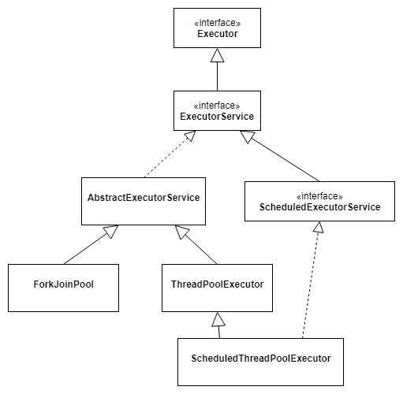

# question-java-thread
some questions and answers for Java Thread.

#### 1. 线程的监视器？如何做线程同步？
监视器和锁一起使用，监视器监视一块同步代码块，确保一次只有一个线程执行同步代码块。<br>
每个监视器都和一个对象引用相关联。<br>
线程在获得锁之前不允许执行同步代码块。<br>
Java提供了显式监视器（Lock）和隐式监视器（synchronized）两种锁方案。？？？<br>

#### 2. 线程的sleep方法、yield方法和对象的wait方法？
wait | sleep | yield
-|-|-
Object类的实例方法 | Thread的静态方法 | Thread的静态方法
放弃对象的锁 | 保持对象的锁 | ？？
进入阻塞状态<br>notify或notifyAll后进入等锁池，重新获得锁后进入就绪态 | 进入阻塞状态<br> | sleep时间结束后自动回到就绪状态	进入就绪状态

#### 3. volatile的作用？实现原理？
(1) 提供顺序（happens-before）保证：阻止JVM对语句重排、确保一个线程对变量的修改对其他线程可见。<br>
(2) 提供可见性保证：CPU缓存（线程工作内存）和主存一致（解决缓存一致性问题）<br>
实例化一个对象的时候也可能发生语句重排，三个步骤：<br>
a. 分配内存空间<br>
b. 初始化对象<br>
c. 将内存空间的地址赋给对应的引用<br>
指令重排后可能先将地址赋给引用，再初始化对象，多线程环境下可能会将未初始化的对象暴露出来。<br>
(3) 将非原子操作变为原子操作（对单个变量的读写具有原子性）（不能保证++操作的原子性）：如double、long类型，64位，每次只能读取32位，不是原子操作，volatile能将其变成原子操作（内存屏障）。<br>
(4) 和CAS结合保证原子性（volatile本身不能保证原子性），如java.util.concurrent.atomic包下的类，AtomicInteger<br>
(5) 常用于标记状态量和double check。<br>

实现原理：lock前缀指令，相当于一个内存屏障，提供以下功能：<br>
a. 重排时不能把屏障后面的指令排到屏障之前<br>
b. 使得本CPU的cache写入主存<br>
c. 写入会使得其他CPU或内核无效化其cache，相当于让新写入的值对其他线程可见<br>

#### 4. 时间处理类SimpleDateFormat非线程安全，用ThreadLocal封装成线程安全。code
SimpleDateFormat内部引用了一个Calendar对象来处理时间，parse方法有一个clear的操作和一个getTime的操作，多线程环境下不同线程如果共享一个SimpleDateFormat对象，调用parsr方法时在clear和getTime之间就会存在冲突。<br>

项目实例：<br>
一个并发较大的接口服务，使用账号+秘钥+时间戳做身份和权限认证，认证的中间件接口定义了一个SimpleDateFormat单例，用于检查时间戳和系统当前时间的差，并发情况下得到的时间差不正确。

#### 5. 多线程编程的最佳实践？
(1) 给线程命名<br>
(2) 最小化同步的范围，而不是对整个方法同步<br>
(3) 优先使用volatile，而不是synchronized<br>
(4) 使用更高层次的并发工具进行线程间通信，而不是wait()和notify()，比如BlockingQueue、CountDownLatch、Semeaphore<br>
(5) 优先使用并发集合，而不是对集合进行同步。并发集合提供更好的扩展性。<br>
(6) 使用线程池

#### 6. volatile和synchronized的比较
线程安全包括两个方面：原子性和可见性<br>
锁提供了两种特性：互斥和可见性<br>

多线程环境下内存可分成主内存和线程的本地内存，线程执行时，将变量从主内存读到本地内存，操作后，在某一时间将变量写回主内存。为了加快速度，写回主内存之前可能先在寄存器或CPU缓存上进行，这时变量的新值对其他线程是不可见的。<br>
volatile修饰的变量修改时，会将缓存中的修改前的值清除。告知JVM寄存器中的值是不确定的，需要从主内存中读取<br>

synchronized关键字的作用有三个：<br>
(1) 确保线程互斥的访问同步的代码<br>
(2) 确保共享变量的修改及时可见<br>
(3) 有效解决重排问题

synchronized的底层语义通过一个monitor的对象来完成。每个对象都有一个监视器锁（monitor），monitor被占有时对象处于锁定状态，monitor每次进入加1.

volatile | synchronized
-|-
轻量级，只能修饰变量 | 重量级，可修饰变量、方法
只能保证可见性 | 能保证可见性和原子性
不会造成线程阻塞 | 可能造成线程阻塞

#### 7. CAS同步非阻塞的无锁算法？
CAS是乐观锁技术，当多个线程尝试使用CAS同时更新一个变量时，只有一个能成功更新，其他都失败，失败的线程不会挂起，可以再次尝试。<br>
CAS有三个操作数，内存值V，预期的旧值A，新值B，仅当内存值等于预期的旧值时，才会将值更新为新值B，否则什么都不做。<br>
当同步出现冲突的机会很小时，这种机制相较于synchronize能提高性能。<br>
CAS是CPU指令级的操作，只有一步原子操作。

应用：java.util.concurrent.atomic中的类，如AtomicInteger的自增操作，可调用incrementAndGet方法。<br>
CAS实现原子操作的三个问题：<br>
(1) ABA问题。CAS算法在操作值的时候检查有没有变化，没有变化则更新，但一个值从A变成B，再变回A，则检查不出有变化。解决办法是使用版本号：1A->2B->3A<br>
(2) 循环时间长开销大。自旋CAS如果长时间不成功，会给CPU带来非常大的执行开销。<br>
(3) 只能保证一个共享变量的原子操作。Java 1.5开始JDK提供了AtomicReference类来保证对象引用间的原子性，可以把多个变量放进一个对象中进行CAS操作。

#### 8. 线程的start方法和run方法的区别？
start方法用来启动新创建的线程，内部调用了run方法。<br>
调用run方法的时候，只是在原来的线程中调用，没有启动新的线程。

#### 9. 什么是竞态条件（Race Condition）？
计算的正确性取决于多个线程的交替执行时序时，就会发生竞态条件。<br>
导致竞争条件的区域称为临界区（Critical Section）。<br>
最常见的竞态条件是先检测后执行，比如单例模式的懒汉式实现，先检测实例是否存在，再实例化。

#### 10. 如何停止一个线程？
(1) 使用退出标志，设置一个bool变量（用volatile修饰），在run方法中判断bool变量决定是否执行，可以在线程外改变bool的值来退出线程。<br>
(2) stop方法，不推荐<br>
(3) interruput方法

#### 11. 线程间通信方式？
(1) 同步，通过synchronized关键字<br>
(2) while轮询，浪费CPU资源<br>
(3) wait/notify<br>
(4) 管道

#### 12. 编写两个线程，一个线程打印1\~52，另一个线程打印字母A\~Z，打印顺序为12A34B56C……5152Z，要求使用线程间的通信。code

#### 13. 为什么wait、notify、notifyAll这些方法放在Object中而不是Thread中？
Java提供的锁是对象级的而不是线程级的，每个对象都有锁，通过线程可以获得。<br>
线程需要等待某些锁调用对象的wait方法就有意义了，如果wait方法定义在Thread中，线程在等待的就不知道是哪个对象的锁。

#### 14. 线程的interrupted方法和isInterrupted方法的区别？
interrupted方法用于中断线程，调用线程的该方法将线程置为“中断状态”，但不会停止线程，需要用户去监听线程的状态并做处理，是否会抛出中断异常。<br>
两个方法最终都会调用一个本地方法，传递一个参数，是否将中断状态清除<br>

interrupted | isInterrupted
-|-
Thread的静态方法 | Thread的实例方法
作用于当前线程 | 作用于调用该方法的线程对象对应的线程
清除中断状态 | 不清除中断状态

#### 15. wait和notify为什么需要在同步代码块中调用？
(1) API强制要求，否则会抛出IlleagelMonitorStateException<br>
(2) 避免竞态条件，比如生产-消费模型，生产和消费都是“先检查后执行”，如果没有在synchronized代码块中执行wait/notify，可能出现生产者还没wait，消费者就先notify，那之后生产者就永远不会被通知到。

#### 16. 对于线程来说，堆内存和栈内存有什么区别？
每个线程都有自己的栈内存，用于存储本地变量、方法参数、栈调用，一个线程中存储的变量对其他线程是不可见的。<br>
堆内存是所有线程共享的，对象都在堆中创建。<br>
为了提高效率，线程会从堆中弄一块内存缓存在自己的栈中，如果多个线程使用同一个变量就会引发问题，这时volatile变量就会发挥作用了，它要求线程从主内存中读取该变量的值。

#### 17. 多线程生产-消费模型实例？在分布式环境下如何实现？
wait-notify<br>
BlockingQueue<br>
Lock、Conditiion<br>
模型的本质是传递生产者和消费者之间的消息，分布式环境下可用第三方传递消息的媒介，如Zookeeper、Redis、Kafka。

#### 18. 多线程信号灯（信号量）模型？code
Semaphore，信号量，限制某段代码块的并发数，由构造函数的参数传入。超出数量的线程需要等待，直到某个线程执行完了，下一个线程才能进入。

#### 19. 多线程哲学家就餐模型？code

#### 20. 多线程CountDownLatch使用？
适用于几个子线程运算后由一个主线程汇总计算结果的场景。
用于模拟并发的请求。

#### 21. 多线程Lock和Condition类的使用？code
生产-消费模型

#### 22. 死锁的条件？实例？如何避免死锁？写一段死锁的代码？code
(1) 互斥条件：一个资源每次只能被一个进程使用<br>
(2) 请求与保持条件：一个进程因请求资源而阻塞时，已获得的资源不释放<br>
(3) 不剥夺条件：进程已获得的资源，在使用完之前，不能强行剥夺<br>
(4) 循环等待条件：若干进程之间形成一种首尾相接的循环等待资源关系<br>

避免死锁最简单的方法就是阻止循环等待条件，将系统中所有资源设置标志位、排序，规定所有进程申请资源必须以一定的顺序。<br>
避免嵌套加锁：已经取得了一个资源，避免在释放前去获取另一个资源<br>
避免无期限的等待：设置最长等待时间（如何设置？？？）

#### 23. 如何保证多个线程按顺序执行？code
使用线程的join方法，先启动最后一个线程，依次调用前一个线程的join方法。

#### 24. 什么是Java中的ReadWriteLock？实例？code
用来提升并发程序性能的锁分离技术。<br>
一个ReadWriteLock维护一对关联的锁，一个用于只读一个用于写。<br>
在没有写线程的情况下一个读锁可能会被多个线程持有，而写锁是独占的。<br>
适用于缓存的实现。

#### 25. volatile变量和atomic变量的区别？Atomic源码？？？
volatile变量能保证先行关系，即写操作会发生在后续的读操作之前，但不能保证原子性，如++操作。<br>
AtomicInteger类提供的具有原子性的getAndIncrement方法。

#### 26. Java中进程和线程的区别？
一个进程对应一个执行的程序，一个线程则是进程执行过程中一个单独的执行序列。<br>
一个进程可以包含多个线程。<br>
线程也被称为轻量级的进程。<br>
一个Java虚拟机的实例运行在一个单独的进程中，不同的线程共享Java虚拟机进程的堆内存，同时保有自己的栈内存。

#### 27. 线程“等待”状态和“阻塞”状态的区别？
阻塞：试图获得一个锁，而这个锁正被其他线程持有<br>
等待：等待另一个线程通知调度器来唤醒？<br>
两者都会暂停线程的执行，进入waiting状态是线程主动的，进入blocked状态是被动的。<br>
进入waiting状态是在同步代码块内，进入blocked状态是在同步代码块外。

#### 28. 线程“同步”和“阻塞”的区别？“同步阻塞”和“同步非阻塞”？

#### 29. 什么是线程调度器（Thread Scheduler）和时间分片（Time Slicing）？
线程调度器是一个操作系统服务，为runnable状态的线程分配CPU时间。<br>
一个线程创建并启动后，它的执行便依赖于线程调度器的实现。<br>
时间分片是指将可用的CPU时间分配给可用的runnable线程的过程。<br>

#### 30. 为什么wait()、notify()、notifyAll()必须在同步方法或同步代码块中调用？
&emsp;&emsp;当一个线程需要调用一个对象的wait方法的时候，必须拥有该对象的锁，调用后会释放锁并进入等待状态，直到其他线程调用这个对象的notify方法。<br>
&emsp;&emsp;同样的，线程调用对象的notify方法时，会释放对象的锁，其他等待的线程可以得到这个对象的锁。<br>
&emsp;&emsp;所有的这些方法都需要线程持有对象的锁，只能通过同步来实现。

#### 31. 为什么Thread类的sleep()和yield()方法是静态的？
sleep()和yield()方法将在当前正在运行的线程上执行，在其他等待状态的线程上调用是没有意义的。

#### 32.什么是守护线程？如何创建守护线程？
守护线程（daemon thread）是个服务线程，服务于用户线程。<br>
在调用start()方法之前调用setDaemon(true)方法。

#### 33. 什么是线程的Callable和Future？Callable和Runnable的区别？code
Callable类似于Runnable，Callable执行后可以返回值，这个值可以被Future拿到。<br>
适用于复杂的计算，主线程开启子线程去执行计算，用Future获取计算结果。

#### 34. 在静态方法上使用同步会怎样？
&emsp;&emsp;同步静态方法时会获取该类的Class对象，当一个线程进入同步的静态方法时，线程监视器获取类本身的对象锁，其他线程不能进入这个类的其他静态同步方法。<br>
&emsp;&emsp;在实例方法上使用同步，多个线程可以同时访问不同实例的同步方法。

#### 35. 两个线程可以同时调用同一个对象的两个不同的同步方法吗？
不能。当一个线程进入该对象的一个同步方法时，线程获取了该对象的对象锁，只有执行完了同步方法释放了对象锁，才能执行其他同步方法。

#### 36.什么是线程饿死？什么是活锁？
线程饥饿指的是无法访问到需要的资源而无法继续执行，引发饥饿问题的常见资源是CPU时钟周期。<br>
活锁指的是线程不断重复同样的操作，但每次操作的结果都是失败的。不会引发阻塞，但程序也无法继续执行。解决办法是每次操作引入随机机制。

#### 37. Java中用到的线程调度算法是什么？
抢占式。<br>
一个线程用完CPU后，操作系统会根据线程优先级、线程饥饿情况等数据算出一个总的优先级并分配下一个时间片给下一个线程执行。<br>
时间片轮转。

#### 38. Thread.sleep(0);有什么用？
由于Java采用抢占式的线程调度算法，所以可能出现某个线程经常获得CPU控制权的情况，为了让一些优先级较低的线程也能获取控制权，可以用这个语句手动触发一次操作系统分配时间片的操作，这也是平衡CPU控制权的一种操作。

#### 39. 如何获取线程dump文件？
先获取到线程的pid，可以通过jps命令，在linux下可以用命令ps -ef | grep java<br>
再打印线程堆栈，通过jstack pid命令，在linux下可以用命令kill -3 pid<br>
Windows下可以使用ctrl+break。

#### 40. 怎样检测一个线程是否持有对象监视器？
Thread类提供了holdsLock(Object obj)的方法，当对象obj的监视器被某个线程持有时才会返回true。<br>
这是一个static方法，“某个线程”指的是当前线程。

#### 41. 线程池的作用？
(a) 降低资源消耗。通过重复利用已创建的线程减少线程创建和销毁的消耗。<br>
(b) 提高响应速度。任务到达时，不需要等待线程创建就能执行。<br>
(c) 提高线程的可管理性。<br>
(d) 控制并发数。<br>

#### 42. 线程生命周期状态图？
新建状态（New）：新创建的线程对象，还没有调用start()方法。<br>
就绪状态（Runnable）：线程对象的start()方法被调用，位于可运行线程池中，等待获取CPU使用权。<br>
运行状态（Running）：就绪状态的线程获得了CPU使用权，执行代码。<br>
阻塞状态（Blocked）：线程因为某种原因放弃CPU使用权，暂停运行，有三种情况：<br>
                  &emsp;&emsp;等待阻塞：执行wait()方法，被放入等待池中。<br>
                  &emsp;&emsp;同步阻塞：获取对象的同步锁时，锁被其他线程占用，被放入锁池。<br>
                  &emsp;&emsp;其他阻塞：执行sleep()或join()方法，或者发出了I/O请求。<br>
死亡状态（Dead）：执行完成或因异常退出了run()方法。<br>

枚举值：<br>
NEW：初始状态，线程被构建，但还没有调用start()方法。<br>
RUNNABLE：运行状态，Java线程将操作系统中的“就绪”和“运行”都称为“运行中”。<br>
BLOCKED：阻塞状态，表示线程阻塞于锁。<br>
WAITING：等待状态，进入该状态表示线程需要其他线程做出一些指定动作（通知或中断）<br>
TIME_WAITING：超时等待状态，不同于WAITING，可以在指定的时间内自行返回。<br>
TERMINATED：终止状态，表示线程已执行完毕。<br>

#### 43. ThreadLocal的设计理念和作用？使用场景？
&emsp;&emsp;提供线程内的局部变量，在多线程环境下访问时能保证每个线程内的局部变量独立。<br>
&emsp;&emsp;常用于以下场景：多线程环境下存在对非线程安全的对象的并发访问，而且该对象不需在线程间共享，也不想加锁，则可以用ThreadLocal来使得每个线程拥有这个对象的一个副本。<br>
&emsp;&emsp;消除了竞态条件，不需要同步就保证了线程安全。<br>
&emsp;&emsp;每个线程内部有一个ThreadLocal.ThreadLocalMap（ThreadLocal的静态内部类）类型的成员变量threadLocals，用来存储实际的变量副本，key是当前ThreadLocal变量，value是变量副本。<br>
&emsp;&emsp;在web服务器中，工作线程的生命周期比应用变量的生命周期长，线程局部变量没有释放的话应用有内存泄露的风险。<br>
&emsp;&emsp;ThreadLocalMap没有使用链表或红黑树解决hash冲突的问题，只用数组来维护哈希表，通过线性探测的开放地址法解决冲突。<br>

&emsp;&emsp;使用场景：<br>
&emsp;&emsp;web系统的session存储。Web容器采用线程隔离的多线程模型，一个请求一个线程，没有共享数据。请求到达时将session存储在ThreadLocal中，在请求过程中可以随意使用session，每个请求之间的session不相互影响。

#### 44. 3个线程A、B、C，循环打印ABCABCABC......，使用进程间通信？？？code

#### 45. 线程池java.util.concurrent.ThreadPoolExecutor的实现原理？源码？和ExecutorService的关系？code
ThreadPoolExecutor继承自抽象类AbstractExecutorService，AbstractExecutorService实现了ExecutorService接口，ExecutorService接口继承自Executor接口。<br>
不提倡直接使用ThreadPoolExecutor，而是使用Executors的newPool的方法创建一个ExecutorService。<br>

构造函数的参数：<br>
corePoolSize：线程池应该维护的最小线程数量。<br>
maximumPoolSize：线程池中最大线程数。<br>
keepAliveTime：线程没有执行任务时保持多长时间终止。<br>
BlockingQueue<Runnable> workQueue：阻塞的任务队列，用来存储等待执行的任务。<br>
threadFactory：线程工厂，用来创建线程<br>
handler：当线程池和阻塞队列都满了，拒绝任务的策略。<br>
&emsp;&emsp;AbortPolicy：丢弃任务并抛出RejectedExecutionException异常<br>
&emsp;&emsp;DiscardPolicy：丢弃任务，但不抛出异常<br>
&emsp;&emsp;DiscardOldestPolicy：丢弃队列最前面的任务，重新尝试执行<br>
&emsp;&emsp;CallerRunsPolicy：由调用线程处理该任务<br>

几个方法：<br>
execute()：Executor中声明的方法，在ThreadPoolExecutor中实现，向线程池提交一个任务，由线程池去执行。<br>
submit()：ExecutorServivce声明的方法，在AbstractThreadPoolExecutor中实现。和execute()方法类似，调用了execute()方法，可以使用Future来返回线程执行结果。<br>
shutdown()：关闭线程池。<br>
shutdownNow()：关闭线程池。

定义了一个volatile变量runState，表示线程池的状态，volatile保证这个变量对所有线程可见。取值有0（RUNNING）、1（SHUTDOWN）、2（STOP）、3（TERMINATED）

线程池处理任务的策略：<br>
(1) 如果当前池大小poolSize小于corePoolSize，则创建新线程执行任务<br>
(2) 如果当前池大小poolSize大于corePoolSize，且等待队列未满，则进入等待队列<br>
(3) 如果当前池大小poolSize大于corePoolSize且小于maximumPoolSize，且等待队列已满，则创建新线程执行任务<br>
(4) 如果当前池大小poolSize大于corePoolSize且大于maximumPoolSize，且等待队列已满，则调用拒绝策略处理该任务<br>
(5) 线程池里的每个线程执行完任务不会立即退出，而是检查等待队列是否有任务需要执行，如果在keepAliveTime内等不到新任务，则退出



#### 46. 调用线程start()方法和run()方法的区别？
start()方法启动新创建的线程，使创建的线程的状态变成可运行状态。<br>
调用run()方法的时候，只会在原来的线程中调用，没有创建新的线程，行为和普通的方法一样。

#### 47. 多线程读写同一资源不同步的实例。code

#### 48. Java内置锁synchronized可重入性？code
可重入。某个线程试图获取一个由它自己持有的锁时，请求会成功。

#### 49. 线程运行时发生异常会怎样？
&emsp;&emsp;如果异常没有捕获线程将会停止执行。如果线程持有某个对象的监视器，会立即释放。<br>
&emsp;&emsp;Thread.UncaughtExceptionHandler是用于处理未捕获异常造成线程意外中断的一个内嵌接口，一个未捕获异常造成线程意外中断的时候，JVM会使用线程的Thread.getUncaughtExceptionHandler()来获取UncaughtExceptionHandler，并将线程和异常作为参数传递给handler的uncaughtException()方法处理。

#### 50. 如何在线程间共享数据？？？
通过共享对象，或者是阻塞队列这样的数据结构。

#### 51. 什么是FutureTask？code
&emsp;&emsp;一个可以取消的异步运算。<br>
&emsp;&emsp;运算结束的时候结果才能取回，如果未结束的时候调用get会阻塞。<br>
&emsp;&emsp;实现了Runnable接口，可以通过线程池来执行，或传递给Thread对象执行。如果主线程遇到比较耗时的操作，又不想阻塞时，可以交给FutureTask执行，将结果返回。

#### 52. 线程池ThreadPoolExecutor已满的时候，提交一个任务，会发生什么？question 45
&emsp;&emsp;ThreadPoolExecutor的构造函数可以传入一个BlockingQueue workQueue。<br>
&emsp;&emsp;如果使用的是无界队列LinkedBlockingQueue，近乎认为是无限大的队列，任务可以添加到阻塞队列中。<br>
&emsp;&emsp;如果使用的是有界队列ArrayBlockingQueue，会使用拒绝策略RejectedExceptionHandler处理，默认是AbortPolicy，submit()方法将会抛出一个RejectedExecutionException。

#### 53. Java线程池execute()方法和submit()方法的区别？？？
execute() | submit()
-|-
/ | 都可以向线程池提交任务
返回类型是void | 可以返回持有计算结果的FutureTask对象
定义在Executor接口中 | 定义在ExecutorService接口中，扩展了Executor接口

#### 54. 同步方法的锁对象是什么？String对象为什么不适合做锁对象？？？code
静态方法的锁对象是class的meta对象；非静态方法的锁对象是当前对象this。<br>
String的常量池的影响，，，？？？

#### 55. ExecutorService类的execute()方法和submit()方法的区别？？？使用Executors创建线程池存在的问题？
问题：《阿里巴巴Java开发手册》
(1) 缓存队列LinkedBlockingQueue没有设置固定容量大小，可能导致OOM
```java
public static ExecutorService newFixedThreadPool(int nThreads) {
    return new ThreadPoolExecutor(nThreads, nThreads, 0L, TimeUnit.MILLISECONDS, new LinkedBlockingQueue<Runnable>()); // LinkedBlockingQueue是无界的，默认是Integer.MAX_VALUE
}
public static ExecutorService newSingleThreadPool() {
    return new FinalizableDelegatedExecutorService(new ThreadPoolExecutor(1, 1, 0L, TimeUnit.MILLISECONDS, new LinkedBlockingQueue<Runnable>())); // 同上
}
```
(2) 最大线程数是Integer.MAX_VALUE，可能导致OOM
```java
public static ExecutroService newCachedThreadPool() {
    return new ThreadPoolExecutor(0, Integer.MAX_VALUE, 60L, TimeUnit.SECONDS, new SynchronousQueue<Runnable>()); // 最大线程数是Integer.MAX_VALUE
}
```
(3) 不能自定义拒绝策略
默认丢弃并抛出异常

#### 56. Java能否创建volatile的数组？
能，但只是修饰指向数组的引用，多个线程同时改变数组的元素，并不能起到保护作用。

#### 57. 什么是多线程环境下的伪共享（false sharing）？
&emsp;&emsp;缓存系统中是以缓存行（cache line）为单位存储区的，当多线程修改相互独立的变量时，如果这些变量共享同一个缓存行，会影响彼此的性能，这就是伪共享。<br>
&emsp;&emsp;访问同一块内存区域时是共享，但这里应用程序要访问的独立的变量，是因为缓存行的存在才造成了共享，所以叫伪共享。<br>
&emsp;&emsp;缓存行是2的整数幂个连续字节，一般为32~256字节，最常见的是64字节。<br>
&emsp;&emsp;JDK 1.6中解决办法是使用缓存行填充，使一个对象占用的内存大小为64字节或整数倍，保证一个缓存行里不会有多个对象。<br>
&emsp;&emsp;JDK 1.7会优化掉无用的字段。<br>
&emsp;&emsp;JDK 1.8 缓存行填充被Java原生支持，添加@Contented注解会自动进行缓存行填充。

#### 58. CyclicBarrier和CountDownLatch的区别？
都是java.util.concurrent包下的类，表示代码运行到某个点上。

CyclicBarrier | CountDownLatch
-|-
线程运行到某个点后停止，直到所有线程都到达这个点，再一起继续运行 | 线程运行到某个点后，给一个计数值-1，线程继续运行
只能唤起一个任务 | 可以唤起多个任务
可重用 | 计数值为0后不可再用

#### 59. wait()和notify()/notifyAll()在放弃对象监视器时有什么区别？
wait()会立即放弃，notify()/notifyAll()会等线程剩余代码执行完才放弃。

#### 60. 如何唤醒一个阻塞的线程？
如果线程因为调用了wait()、sleep()、join()方法而阻塞，可以中断线程，并通过抛出InterruptedException来唤醒。<br>
如果线程遇到了IO阻塞就无能为力了，因为IO是操作系统实现的。？？？

#### 61. 什么是自旋？
很多synchronized里面的代码只是很简单的逻辑，能很快执行完，如果等待的线程多加锁可能不太值得，因为线程阻塞涉及到用户态和内核态的问题。<br>
让等待锁的线程不要阻塞，而是在synchronized的边界做忙循环，就是自旋。<br>
如果做了多次忙循环还没有获得锁，再阻塞。

#### 62. 线程类的构造方法、静态代码块是哪个线程调用的？
被new这个线程类所在的线程调用。<br>
run方法是线程类自身调用。

#### 63. Fork/Join框架？工作窃取算法？
&emsp;&emsp;Java 7提供的一个用于并行执行任务的框架，将一个大任务分割成多个小任务，汇总小任务的结果得到大任务的结果。<br>
&emsp;&emsp;工作窃取算法：将大任务分割成多个互不依赖的子任务，为了减少线程间竞争，将子任务分到多个队列，每个队列由一个线程来执行。<br>
&emsp;&emsp;有的线程执行完自己的任务后，会从其他队列窃取任务来执行，会访问同一个队列，为了减少竞争，会使用双端队列，分配的线程从队头取任务，窃取的线程从队尾取任务。

#### 64. 同步方法和同步代码块的区别？
同步方法默认使用this或者当前类的Class对象作为锁。<br>
同步代码块可以选择其他对象作为锁。

#### 65. Java中的几种锁？code
(a) 自旋锁：JDK 1.6之后默认开启。基于之前的观察，共享数据的锁定时间很短，频繁挂起和恢复线程不太值得，所以让请求锁的线程不放弃处理器，而是做忙循环的自旋，看占有锁的线程能否很快释放。<br>
(b) 偏向锁：消除数据在无竞争状态下的同步原语？？？进一步提升性能。偏向第一个获取它的线程，如果这个锁没有再被其他线程获得，则该线程永远不再需要同步。可以提高带有同步但无竞争的程序的性能。<br>
(c) 轻量级锁：无锁->偏向锁->轻量级锁->重量级锁，随着竞争逐步升级，不能降级。<br>

(1) 公平锁/非公平锁<br>
公平锁：多个线程按照申请锁的顺序来获取锁。<br>
非公平锁：多个线程获取锁的顺序并不是申请锁的顺序，优点在于吞吐量比公平锁大，但可能造成优先级反转或者饥饿。<br>
(2) 可重入锁/不可重入锁<br>
可重入锁：可重复可递归调用的锁，在外层所用锁后，内层仍可以使用，并且不发生死锁。ReentrantLock和synchronized都是可重入锁。<br>
不可重入锁：与重入锁相反，不可递归调用，递归调用会发生死锁。<br>
(3) 独享锁/共享锁<br>
独享锁：每次只能被一个线程持有。<br>
共享锁：可被多个线程共有，比如ReentrantReadWriteLock的读锁是共享的，但写锁是独占的。<br>
(4) 互斥锁/读写锁<br>
读写锁：读写锁既是互斥锁，又是共享锁，read模式是共享，write模式是互斥的。<br>
读写锁有三种状态：读加锁、写加锁、不加锁。<br>
(5) 乐观锁/悲观锁<br>
悲观锁：synchronized和ReentrantLock等独占锁是悲观锁的思想的实现。<br>
乐观锁：读的时候认为不会被修改，不加锁，但是写的时候会判断是否被更新过，可以使用版本号和CAS算法实现。<br>
乐观锁适用于多读的场景，可以提高吞吐量。<br>
java.util.concurrent.atomic下面的原子变量类就是乐观锁，使用CAS实现。<br>
(6) 分段锁<br>
分段锁是一种设计的思想，不是具体的一种锁，对于ConcurrentHashMap而言，并发的实现就是通过分段锁来实现高效的并发操作。<br>
(7) 偏向锁/轻量级锁/重量级锁<br>
锁的状态：无锁、偏向锁、轻量级锁、重量级锁。<br>
锁的状态是通过对象监视器在对象头中的字段来表示的，四种状态会随着竞争的情况逐渐升级，而且是不可逆的。这四种状态都不是Java语言中的锁，而是jvm为了提高锁的获取和释放的效率而做的优化。<br>
偏向锁：一段同步代码一直被一个线程访问，那么该线程会自动获取锁，降低获取锁的代价。<br>
轻量级锁：当锁是偏向锁的时候，被另一个线程访问，偏向锁就会升级为轻量级锁，其他线程通过自旋的方式尝试获取锁，不会阻塞，提高性能。<br>
轻量级锁：不加锁，只是标记一个状态，使用CAS机制改变状态<br>
重量级锁：当锁是轻量级锁的时候，另一个线程虽然自旋，但不会一直持续下去，到一定次数会进入阻塞，膨胀为重量级锁。重量级锁会让其他线程进入阻塞，降低性能。<br>
重量级锁：获取不到马上进入阻塞的锁。<br>
(8) 自旋锁/自适应自旋锁<br>
一个线程在获取锁的时候，如果该锁已经被其他线程获取，将会循环等待，直到获取到锁才退出循环。<br>
优点：不会使线程状态发生切换，一直处于用户态，减少了上下文切换，执行速度快。<br>
问题：某个线程持有锁的时间过长，会导致其他线程进入循环，消耗CPU。不公平的锁会存在线程饥饿的问题。<br>
自适应自旋锁：能够根据线程最近获得锁的状态来调整循环次数的自旋锁<br>
(9) 可中断锁<br>
在等待获取锁的过程中可以中断

#### 66. ThreadLocal内存泄露问题？
&emsp;&emsp;ThreadLocal有一个ThreadLocalMap的内部类，由一个个Entry组成，Entry继承自WeakReference<ThreadLocal<?>>，一个Entry由Threadlocal（key，弱引用）和Object构成，没有指向key的强引用时，key就会被回收。<br>
&emsp;&emsp;Key是弱引用，但value是强引用，当线程的ThreadLocal使用完，没有强引用指向key时，key的对象会被回收，变成null，但value和value指向的对象仍是强引用关系，不会被回收。<br>
&emsp;&emsp;每次调用ThreadLocal的get，set，remove方法时，会将key为null的Entry删除，避免内存泄露。但如果将对象放入ThreadLocalMap后就不再调用这些方法，仍可能导致内存泄露，需要在使用完ThreadLocal后手动remove。

#### 67. happens-before规则：
程序顺序规则：一个线程中的每个操作，happens-before于该线程的任意后续操作<br>
监视器锁规则：对一个对象的解锁，happens-before于对这个对象的加锁<br>
volatile变量规则：对于一个volatile域的写，happens-before于对这个域的读<br>
传递性：如果A happens-before 于B，B happens-before 于C，则A happens-before 于C。

#### 68. JVM最多支持多少个线程？code

#### 69. synchronized关键字和Lock接口的区别？
项 | synchronized | Lock
-|-|-
存在层次 | Java的关键字，在JVM层面 | Java实现
锁的释放 | 获取锁的代码块执行完毕释放，异常时JVM会让线程释放锁 | 必须手动在finally中释放，否则会造成死锁
锁的阻塞 | 若A获得锁，则B等待；若A阻塞，则B一直阻塞 | 线程可以尝试获得锁，不用一直等待
锁状态 | 无法判断 | 可判断，通过tryLock()得知当前线程是否获得锁
锁类型 | 可重入、非公平、不可中断 | 可重入、公平（可不公平）、可中断
性能 | 少量同步？？？ | 大量同步？？？


#### 100. question100
