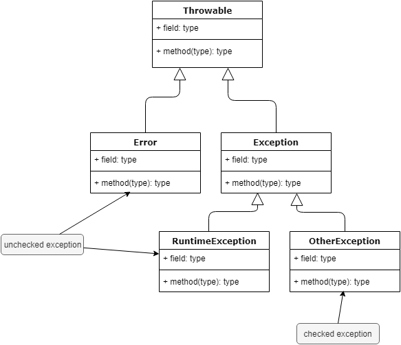
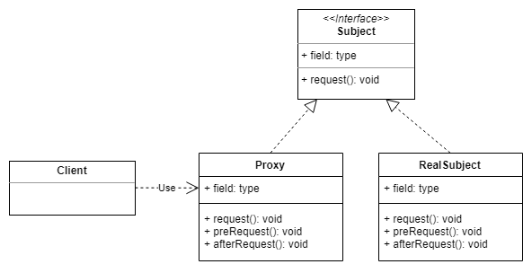
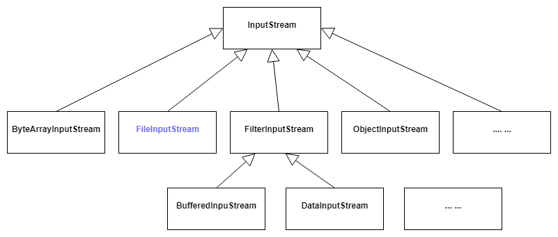
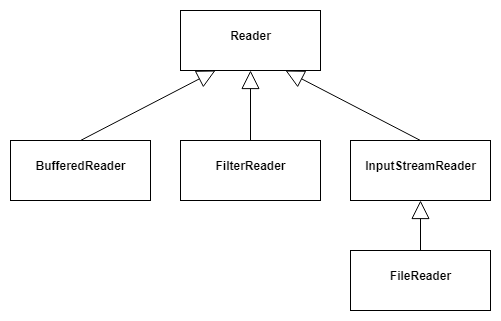

[TOC]

#### 1. 接口多继承？code
Java类不能多继承，但接口之间可以多继承。

#### 2. Java的两种异常？
运行时异常 RuntimeException | 检查式异常 checkedException
-|-
异常出现时由虚拟机接管 | 必须try catch
ClassCastException<br>NullPointerException<br>IndexOutOfBoundsException<br>ArithmeticException<br>UnmodifiableSetException | /

异常的基类为Throwable，Error和Exception继承自Throwable；<br>
RuntimeException继承自Exception;<br>
Error和RuntimeException及其子类是unchecked exception，其他的Exception类都是checked exception



#### 3. 数据库语句Statement、PreparedStatement和CallableStatement
Statement | PreparedStatement | CallableStatement
-|-|-
/ | 预编译，性能更好<br>可以重用<br>安全，减少SQL注入攻击 | 执行存储过程。<br>存储过程可以接收参数，也可以返回结果。<br>提供了安全性和模块化。<br>CallableStatement.prepareCall();

#### 4. PreparedStatement如何减少SQL注入攻击？
PreparedStatement使用预编译机制，参数用占位符?代替，setXX传入参数的时候已经过了预编译，所以传入特殊值不会起作用。<br>
PreparedStatement不允许在插入参数时改变查询的逻辑结构，只是把输入参数作为数据处理，不需要再进行解析。

#### 5. 数据库连接池有哪些？各自的优缺点？
C3P0、DBCP、tomcat-jdbc-pool、Druid<br>
C3P0和DBCP是单线程的，tomcat-jdbc-pool支持高并发

#### 6. 类加载器的双亲委派模型？
&emsp;&emsp;除了顶层的启动类加载器，其他的类加载器都有自己的父类加载器。<br>
&emsp;&emsp;如果一个类加载器收到了加载类的请求，首先会将请求委派给父类加载器，所有的请求最终都会传递到顶层的启动类加载器。父类加载器反馈无法加载时，子类加载器才自己去加载类。<br>
&emsp;&emsp;Java类随着它的类加载器具备了一个优先级的层次关系，比如Object类只能由顶层的启动类加载器加载。<br>
&emsp;&emsp;类加载器的层级关系：启动类加载器（Bootstrap ClassLoader）->扩展类加载器（Extension ClassLoader）->应用程序类加载器（Application ClassLoader）->自定义类加载器（User ClassLoader）。<br>
- Bootstrap ClassLoader: 启动类加载器，是Java类加载层次中最顶层的加载器，负责加载JDK中的核心类库，如rt.jar, resources.jar, charsets.jar等。<br>
- Extension ClassLoader: 扩展类加载器，负载加载Java的扩展类库，默认加载JAVA_HOME/jre/lib/ext目录下的所有jar.<br>
- Application ClassLoader: 系统类加载器，负责加载应用程序classpath目录下的所有jar和class文件。
- 自定义ClassLoader: 用户自定义，必须继承自java.lang.ClassLoader

#### 7. 类实例化的顺序？code question041 question064
(1)	初始化父类的静态代码块，包括静态变量<br>
(2)	初始化子类的静态代码块<br>
(3)	初始化父类的非静态代码，包括非静态变量<br>
(4)	执行父类的构造函数<br>
(5)	初始化子类的非静态代码<br>
(6)	执行子类的构造函数<br>

#### 8. Java的BIO、NIO和AIO？code
BIO | NIO | AIO
-|-|-
同步阻塞 | 同步非阻塞 | 异步非阻塞
多线程，一个连接一个线程 | 少量线程或单线程，多个连接共用一个线程，一个请求一个线程 | 一个有效请求一个线程
面向流 | 面向缓冲<br>多通道 | /
适用于连接数量比较小且固定的场景 | 适用于连接数量多，但连接比较短的场景 | 适用于连接数量多且连接长的场景

Java NIO中有一个选择器（selector），可以将多个通道（channel）注册到一个选择器上，然后使用一个线程来监视这些线程：如果这些通道中有某个可以进行读写操作，则进行相应的读写操作。在等待通道变为可读写的时候，请求的线程可以去做别的事情。

#### 9. Java静态代理和动态代理？动态代理的实现方式？实际的应用？？？code
**静态代理**：自己创建一个代理类。定义一个抽象角色（接口），真实角色和代理角色都去实现这个接口，将真实角色的对象传入到代理角色中。<br>
**动态代理**：程序自动生成代理，JDK动态代理和CGlib动态代理。<br>
**JDK动态代理**：实现一个动态代理器，真正的代理对象由JDK在运行时动态创建，动态代理器主要提供获取代理对象实例的方法。被代理的类必须通过接口提供业务方法。
```java
public Object getProxyInstance() {
    // 传入三个参数，目标对象的类加载器、目标对象实现的接口的类型、动态处理器
    return Proxy.newProxyInstance(realStar.getClass().getClassLoader(),
        realStar.getClass().getInterfaces(),
        (proxy, method, args) -> {
            System.out.println("before sing");
            Object object = method.invoke(realStar, args);
            System.out.println("after sing");
            return object;
        }
    );
}
```
**CGlib动态代理**：通过底层的字节码技术为目标类创建一个子类，在子类中拦截父类的方法调用，织入横切逻辑。<br>
**应用**：spring框架的AOP。如果目标对象实现了接口，默认用JDK动态代理，否则用CGlib动态代理。


#### 10. 深复制和浅复制？code
浅复制：被复制的对象的所有变量都与原对象有相同的值，而对其他对象的引用仍指向原对象。即只考虑要复制的对象，不考虑该对象引用的其他对象。<br>
深复制：被复制的对象的所有变量都与原对象有相同的值，对其他对象的引用指向新复制的对象。即把要复制的对象引用的其他对象也复制了一遍。<br><br>
深复制有两种方式：<br>
(1) 重写需要复制的对象的clone方法，将引用的对象也复制一遍<br>
(2) 使用序列化和反序列化的方法。

#### 11. 创建对象的几种方式？code
(1) new<br>
(2) Class类的newInstance方法<br>
(3) Constructor类的newInstance方法<br>
(4) clone<br>
(5) 反序列化<br>
前三种调用了构造函数。两种newInstance就是反射，Class的newInstance方法内部调用了Constructor的newInstance方法，众多框架如Spring、Hibernate使用的是Constructor。

#### 12.Java的四种引用，强引用、软引用、弱引用、虚引用？？？？？？？？？？
强引用 |	软引用 | 弱引用 | 虚引用
-|-|-|-
引用存在则永远不会回收，即使内存不足，也是抛出OutOfMemory。<br>通过赋值为null可以中断强引用和对象的关联。 | 内存溢出之前回收 | 第二次垃圾回收时回收。<br>一旦发现就会回收？？？ | 每次垃圾回收都会被回收
/ | 实现图片缓存功能，内存不足时回收不再使用的Bitmap | / | 用来跟踪对象被垃圾回收的回收活动

因为Java的垃圾回收时机是不可控的，所以使用不同的引用类型来适当控制对象被回收的时机。<br>
通过软引用实现Java对象的高速缓存：软引用和HashMap的结合。？？？

#### 13. 连接MySQL数据库的语句？code

#### 14. JDK 1.6和JDK 1.7的substring方法的区别？
1.7版本的substring方法会new String()创建一个新的字符串，1.6不会

#### 15. 子类能否覆盖（override）父类的static方法？能否覆盖private方法？code
不能。覆盖是运行时动态绑定的，而static方法是在编译时静态绑定的。子类中可以有和父类中签名一样的方法，但不能用@override声明，一般称为隐藏。<br>
不能。也不能被继承。

#### 16. a = a + b;和a += b;的区别？
+=操作隐式的将结果强制转换为持有结果的类型。<br>
两个整型相加，如byte、short、int会提升到int类型，然后做加法操作

#### 17. 能否创建一个包含不可变对象的可变对象？
可以，如包含日期对象的自定义对象。不能共享可变对象的引用

#### 18. JRE、JDK、JVM、JIT？
JRE：Java run-time environment，Java运行时环境<br>
JDK：Java development kit，开发工具，如编译器，也包括jre<br>
JVM：Java virutal machine，Java虚拟机，运行java程序<br>
JIT：Just In Time compilation，即时编译，将热点代码的字节码转化为本地代码，提高性能

#### 19. 怎样获取Java程序使用的内存？code
java.lang.Runtime类，freeMemory()、totalMemory()、totalMemory()等方法

#### 20. 编译期常量？
public static final修饰的成员。<br>
在编译时会被替换掉，因为编译器直到这些常量的值，并且知道他们在运行时是不改变的。<br>
如果依赖的第三方库中有编译期常量，且引入后又发布人又修改过，则需要重新编译，否则使用的还是旧的值。

#### 21. 什么时候用享元模式？
享元模式通过共享对象来避免创建过多的对象。需确保对象是不可变的。<br>
JDK中的String池、Integer池都是享元模式的例子。<br>
数据库连接池、线程池。

#### 22. 访问修饰符的作用范围由大到小：
public > protected > default > private

作用域 | 当前类 | 同一package | 子孙类 | 其他package
-|-|-|-|-
public | √ | √ | √ | √
protected | √ | √ | √ | ×
friendly | √ | √ | × | ×
private | √ | × | × | ×

#### 23. IO操作的两种方式？InputStream、OutputStream、Writer、Reader的类关系？？？
面向字节（Byte） | 面向字符（Character）
-|-
以8位为单位对二进制数据进行操作 | 以字符为单位对数据进行操作
InputStream和OutputStream的子类 | Reader和Writer的子类


<br><br>


#### 24. 如何跳出当前的多重嵌套循环？code
使用标号。

#### 25. Java中负数的二进制如何表示？byte类型、int类型运算的溢出？
负数使用正值的补码表示。（反码加1则为补码）<br>
int类型溢出项目实例：<br>
两个系统交互，传送文件，用一个int类型的值保存文件的大小，单位为B（字节）。int类型能表示的最大整数约为2,000,000,000，即int类型值表示的最大文件大约为2GB，当文件大于2GB时则发生了int类型的溢出。

#### 26. Math类的三个取整的方法？
ceil，floor和round<br>
ceil：向上取整<br>
floor：向下取整<br>
round：加0.5后再向下取整<br>

#### 27. 注册jdbc驱动程序的三种方式？
```java
Class.forName("com.mysql.jdbc.Driver"); // 不会对具体的驱动类产生依赖，将Driver类加载到JVM中
DriverManager.registerDriver(new com.mysql.jdbc.Driver()); // DriverManager中有两个同样的驱动，对具体的驱动类产生依赖，不方便扩展
System.setProperty("jdbc.drivers", "com.mysql.jdbc.Driver"); // 通过系统的属性设置注册驱动，很少使用
```
Driver类静态代码块：
```java
static {
    try {
        java.sql.DriverManager.registerDriver(new Driver());
    } catch (SQLException e) {
        throw new RuntimeException("can't regist driver!");
    }
}
```

#### 28. 如何创建一个不可变（immutable class）对象？JDK有哪些不可变对象？？？
(1) 类用final修饰<br>
(2) 类的所有成员都用final修饰<br>
(3) 如果包含可变的成员，则在获取该成员的时候返回一个拷贝<br>
另一种回答：<br>
(1) 将所有成员声明为私有的<br>
(2) 通过构造函数初始化所有成员<br>
(3) 对变量不要提供setter方法<br>
(4) 在getter方法中，不要返回对象，而是克隆对象，返回对象的拷贝<br><br>
怎么证明不可变？？？？？？？？？？？<br><br>
JDK的不可变类有String、Integer和其他包装类型。

#### 29. Java中的构造器链？
在一个构造器中调用了另一个构造器，只在重载了类的构造器的时候有可能出现。

#### 30. 使用递归的方法将一个字符串反转？code

#### 31. 不使用临时变量的情况下交换两个整数的值？code

#### 32. main方法不用static修饰会怎样？为什么是公有的（public）、静态的（static）、无返回值的（void）？code
错误: 找不到或无法加载主类。

public：
main方法是公有的，才能被JVM访问执行。

static：
JVM调用静态方法不需要创建包含这个main方法的实例。
main方法作为程序的入口，如果不是静态，JVM不知道去哪个类中寻找main方法。
C/C++中有一个main的全局方法。

void：
返回值对程序没有意义。

#### 33. 请求转发和请求重定向？
转发 | 重定向
-|-
服务端行为 | 客户端行为
request.getRequestDispatcher().forward() | response.sendRedirect()
一次请求 | 两次请求
客户端url地址不变 | 客户端url地址改变

#### 34. 反射的作用是什么？什么是动态语言？Java是不是动态语言？
动态语言是指在运行时可以改变其结构：引进或删除函数。如JavaScript、Python、Ruby<br>
动态语言在运行时才检查类型，静态语言在运行前检查，如编译阶段。<br>
动态语言不需要写过多关于类型的代码，方便阅读，但不易调试；静态语言结构规范，易于调试，但需要写更多的类型代码。<br>
Java是静态语言，或“准动态语言”，主要体现在反射和动态编译、动态类型转换、动态字节码操作。<br>

反射机制是Java被视为准动态语言的关键特质。允许程序在运行时通过反射得到一个已知名称的类的内部信息。<br>

反射的作用：<br>
(1) 在运行时判断任意一个对象所属的类<br>
(2) 在运行时判断任意一个类具有的成员变量和方法<br>
(3) 在运行时调用任意一个对象的方法<br>
(4) 在运行时构造任意一个类的对象<br>
(5) 生成动态代理操作<br>

反射的缺点：<br>
(1) 性能相对较低<br>
(2) 不安全，破坏了类的封装性（获取类的私有方法和属性）

#### 35. Java创建实例化对象的几种方式？
(1) new语句<br>
(2) 工厂方法，如String s = String.valueOf();<br>
(3) 反射机制，Class类的三种方法，或者通过类类型的newInstance()方法<br>
(4) clone<br>
(5) 反序列化

#### 36. 注解的原理？作用？自定义注解？（项目中的使用，参数检查）code
注解是一种元数据，一种描述数据的数据，和业务逻辑无关，用户（其他代码）读取定义的属性并实现必要的逻辑。<br>
四种元注解，用于注解其他的注解：
- @Documented - 注解是否包含在JavaDoc中
- @Retention - 什么时候使用该注解（生命周期）
  - RetentionPolicy.SOURCE：在编译阶段丢弃，不会写入字节码，如@Override @SuperssWarnings
  - RetentionPolicy.CLASS：在类加载的时候丢弃，在字节码的处理中有用，默认的方式
  - RetentionPolicy.RUNTIME：始终不丢弃，运行期也保留，因此可以用反射机制读取注解信息，自定义的注解使用的方式
- @Target - 注解用于什么地方
  - ElementType.TYPE：用于描述类、接口或enum声明
  - ElementType.FIELD：用于描述实例变量
  - ElementType.METHOD：用于描述方法
  - ElementType.PARAMETER
  - ElementType.CONSTRUCTOR
  - ElementType.LOCAL_VARIABLE
  - ElementType.ANNOTATION_TYPE 另一个注释
  - ElementType.PACKAGE 用于记录java文件的package信息
- @Inherited - 是否允许子类继承该注解

#### 37. Socket服务端、客户端实例。code

#### 38. 单例模式和静态变量的区别？
单例模式能保证一个类只有一个实例，而静态变量只是保证该类在当前的类中只有一个实例，其他类可以重新创建该类的实例。<br>
单例模式的类完成自身的初始化。

#### 39. 如何自定义注解？question036

#### 40. 为什么String是不可变的？
(1) 字符串常量池的需要。<br>
(2) 允许String对象缓存HashCode，保证了hash码的唯一性。<br>
(3) 安全性，调用系统级的操作之前可能有一些校验，如果是可变类，校验之后内部值被改变，可能引起严重的问题。<br>
(4) 线程安全

#### 41. 父类与子类之间的调用顺序。code question007 question064
父类静态代码块<br>
子类静态代码块<br>
父类构造函数<br>
子类构造函数<br>
子类普通方法

#### 42. Float类型的变量定义float f = 2.3;是否正确？
不正确。精度不准确，应该加强制类型转换，float f = (float)2.3;或者float f = 2.3f;<br>
没加小数点默认是int，有加小数点默认是double。

#### 43. String编码UTF-8和GBK的区别？code
UTF-8包含了很多国家的字符，涵盖了整个unicode码表，存储一个字符的编码使用长度不确定，1~4个字节；GBK只包含中文的编码，只需要固定的2个字节，能表示6万多个字符。<br>
Java中的string使用的是unicode编码，而UTF-8和GBK是编码格式，string只存在内存中，没有存在文件中或在网络中传输（序列化）时，只有编码，没有编码格式。

#### 44. 静态类和静态方法？静态内部类和非静态内部类？
静态类都是静态内部类，没有静态的顶级类，顶级类的修饰只能是public、abstract、final。<br>
静态方法只能访问静态成员，而实例方法可以访问静态成员和实例成员。<br>
静态内部类不会持有外围类的引用，非静态内部类会隐式持有外围类的引用。<br>
非静态内部类可以访问外围类的静态和非静态成员，不能脱离外围类被实体被创建。

#### 45. 枚举类型？
enum类型的构造方法只能是private或friendly，不能是public或protected，所以枚举对象不能再程序中通过调用其构造方法来初始化。<br>
enum类型的值是通过运行时构造出对象来表示的，所以在cluster环境下，每个虚拟机会构造出一个同义的enum对象，可能出现同一个对象值不等的情况。

#### 46. JDK如何保证try-catch-finally中的finally块一定会被执行？
通过冗余。在每个catch语句块后面都finally块的字节码。

#### 47. 数组的length属性和字符串的length()方法？code
数组是一个容器对象，包含固定数量的同一类型的值，创建后长度固定，final的长度可以作为一个属性。<br>
String的数据结构是一个char数组，长度已经在char数组的length属性中提供。

#### 48. Java代码优化实践？code
(1) 比较高效的遍历HashMap的方法：取出Entry集合，对Entry集合遍历<br>
(2) 遍历集合，不要在for循环中每次都调用size()方法获取集合个数

#### 49. equals()方法和==的区别？
==比较两个对象的地址是否相同。<br>
equals()可以重写，String类中比较的是字符串内容是否相同，如果没有重写，Object类中的实现是和==相同。

#### 50. boolean类型的大小是多少？
boolean类型的数据编译之后都使用int类型代替，boolean数据会被编译成byte数组，所以单独使用时占4个字节，在数组中时占1个字节。<br>
使用int的原因是32位的CPU一次进行32位的数据交换更高效。

#### 51.Object类定义了哪些方法？
- clone()：native方法，用于创建并返回当前对象的一份拷贝。一般情况下，对于任何对象x，x.clone() != x为true，x.clone().getClass() == x.getClass()为true。Object本身没有实现Cloneable接口，所以不重写clone方法且进行调用的话会抛出CloneNotSupportedException异常。
- equals()：用于比较两个对象的内存地址是否相等，String类对该方法进行了重写所以比较的是字符串的值是否相等。<br>
- hashcode()：native方法，用于返回对象的hash码，主要使用在哈希表中，比如JDK中的HashMap。<br>
- toString()：返回类的名字@对象的哈希码的十六进制字符串。建议Object的所有子类都重写这个方法。<br>
- wait()：native方法，不能重写。暂停线程的执行。sleep方法没有释放锁，wait方法释放了锁。<br>
- notify()：native方法，不能重写。唤醒一个在此对象监视器（相当于锁的概念）上等待的线程，如果有多个线程在等待只会唤醒一个。<br>
- notifyAll()：native方法，不能重写。和notify一样，唯一区别是唤醒所有等待的线程。<br>
- finalize()：对象被垃圾回收器回收时触发的操作。<br>
- getClass()；native方法，用于返回当前运行时对象的Class对象，使用了final关键字修饰，不允许子类重写。

#### 52. Java动态绑定的内部实现机制？？？
动态绑定是实现“多态”的关键。
执行期间判断所引用对象的实际类型，根据实际类型调用对应的方法。

#### 53.Java中的内存映射缓存区是什么？
MappedByteBuffer是Java NIO引入的文件内存映射方案，读写性能极高。NIO最主要的就是实现了对异步操作的支持。
MappedByteBuffer和操作系统虚拟内存的“页面切换”类似，把整个文件看作一个ByteBuffer，MappedByteBuffer是一种特殊的ByteBuffer，即ByteBuffer的子类。
MappedByteBuffer将文件直接映射到虚拟内存，可以映射整个文件，也可以分段映射。
```java
MappedByteBuffer map(int mode, long position, long size); //
```
将文件从position开始的size大小的区域映射为内存映像文件，mode: READ_ONLY, READ_WRITE, PRIVATE

#### 54. 如何判断素数？code

#### 55. 分解质因数？code

#### 56. 值传递和引用传递？
值传递是对基本类型而言，传递的是变量的一个副本，改变副本不影响原变量。<br>
引用传递是对于对象类型而言，传递的是对象地址的一个副本，并不是原对象本身，对引用对象的修改会改变原对象。<br>
一般认为，Java内的传递都是值传递。如果是基本类型，传递的是值的拷贝，如果是对象类型，传递的是引用地址的拷贝。

#### 57. Java类可以定义析构函数（finalization）吗？
没有真正的析构函数，可以重写finalize方法来自定义额外的操作。

#### 58. finalize()方法什么时候被调用？
垃圾回收器（garbage colector）回收某对象的时候，会调用其finalize()方法。<br>
主要用途是回收特殊渠道申请的内存，有一种JNI（Java Native Interface）调用的non-Java程序（C或C++）。

#### 59. 抽象类的意义？
(1) 为子类提供一个公共的类型<br>
(2) 封装子类中重复定义的内容<br>
(3) 定义抽象方法，子类中虽然有不同的实现，但定义是一致的。

#### 60. Java 8，接口中可以有方法实现？code
Java 8在接口中引入了默认方法，在方法前加default关键字就可以在接口中写方法的默认实现。

#### 61. 静态变量和实例变量的区别？
静态变量存储在方法区，实例变量存储在堆，其引用存储在当前线程栈中。

#### 62. String对象的intern()方法？code
先从常量池中查找是否存在该常量值，不存在则创建，已存在则直接返回。

#### 63. Java 7、8、9、10的新特性？？？code
Java 7新特性：<br>
(1) try-with-resource语句，使用流或者资源的时候不用手动关闭，Java会自动关闭。<br>
(2) Fork-Join，实现了Java版的Map-Reduce。<br>
(3) switch可以用String或文本。（用String.hashCode()将String转为int）<br>
(4) 菱形操作符用于类型推断？？？<br>

Java 8新特性：<br>
(1) Lambda表达式，允许像对象一样传递匿名函数<br>
(2) Stream API，充分利用现代多核CPU，可以写出很简洁的代码<br>
(3) Optional类，解决空指针异常？？？<br>
(4) Date和Time API，线程安全吗？？？<br>
(5) 扩展方法，接口中可以有静态、默认方法、带有实现的方法<br>
(6) 重复注解，相同的注解在同一类型上多次使用。<br>

Java 9新特性：<br>
(1) Jigsaw项目，模块化源码<br>
(2) 轻量级JSON API<br>
(3) 钱和货币的API<br>
(4) HTTP 2.0客户端<br>
(5) 默认GC修改为更复杂、更全面、性能更好的G1（Garbage-First）。？？？<br>

Java 10新特性：<br>
(1) 本地变量（局部变量）类型推断<br>
使用var保留类型名称
(2) 统一JDK仓库<br>
(3) 垃圾回收器接口<br>
(4)

Java 11新特性：<br>
(1) 本地变量类型推断（使用var关键字定义）<br>
(2) 字符串加强<br>
(3) 集合加强<br>
(4) Stream加强<br>
(5) Optional加强<br>
(6) InputStream加强<br>
(7) HTTP Client API<br>
(8) 一个命令编译运行源码，java JavaClass.java

#### 64. 父类、子类、static修饰执行顺序？question007 question041
(1) 父类静态变量和静态代码块<br>
(2) 子类静态变量和静态代码块<br>
(3) 父类成员变量和非静态代码块<br>
(4) 父类构造方法<br>
(5) 子类成员变量和非静态代码块<br>
(6) 类构造方法

#### 65. JDO是什么？
JDO是Java对象持久化的新规范，Java Data Object的简称，一个用于存取某种数据仓库中的对象的标准化API。<br>
JDO提供了透明的对象存储，对于开发者来说存储对象不需要额外的代码（如JDBC），由JDO产品提供商提供。<br>
JDBC只面向关系型数据库，JDO更通用，提供到任何数据底层的存储功能，比如关系型数据库、文件、XML以及对象数据库，可移植性更强。

#### 66. hashCode()和equals()的相关规定？
(1)	两个对象相等，则hashcode一定相同<br>
(2)	两个对象有相同的hashcode，不一定相等<br>
(3)	两个对象相等，则分别调用equals()返回true<br>
(4)	如果equals()方法被重写，则hashcode()方法也必须重写<br>
(5)	hashCode()的默认行为是对堆上的对象产生独特值，如果没有重写，则类的两个对象无论如何都不会相等。

#### 67. 断言的用途？什么时候使用断言？code
断言用于验证假设，如果失败会抛出AssertionError。<br>
断言不应该用于验证方法参数或命令行参数，IllegalArgumentException会是一个更好的选择。在public方法中，只用断言来检查它们根本不应该发生的情况。

#### 68. 什么是初始化数据块？code
创建对象或加载类时执行的代码。<br>
有两种类型的初始化数据块：<br>
静态初始化器：加载类时运行的代码<br>
实例初始化器：创建对象时运行的代码<br>

#### 69. java.util.Date和java.sql.Date的区别？
java.sql.Date针对sql语句，只有日期而没有时间。<br>
都有getTime()方法，返回毫秒数。<br>
java.sql.Date继承自java.util.Date。

#### 70. Java内存结构、内存模型、对象模型的概念？
内存结构：JVM虚拟机运行时的内存区域<br>
内存模型：Java并发编程的一些抽象概念<br>
对象模型：Java对象在虚拟机中的表现形式

#### 71. Java常量池？code
Integer内部维护了一个IntegerCache静态内部类，默认创建了-128~127的对象，在这个范围内的整数对象不用创建，直接从cache数组获取，超出的则创建对象。
```java
Integer a1 = 20;
Integer a2 = 20;
System.out.println(a1 == a2); // true
Integer a3 = 200;
Integer a4 = 200;
System.out.println(a3 == a4); // false
```
从JDK 1.7开始，字符串常量池放在堆中。

#### 72. Java 8中StringJoiner的使用？code
依赖StringBuilder实现，也是线程不安全的。可以用分隔符、前缀、后缀拼接字符串。

#### 73. Java泛型？
能够进行编译期的类型检查，避免不必要的类型错误，加强安全性验证。<br>
Java的泛型是伪泛型。使用泛型的时候加上的类型参数，会在编译的时候去掉，这个过程称为类型擦除。泛型只在编译器有效。

#### 74. 一个Java对象占多大内存？code
一个对象包括三部分：对象头、实例数据、对齐填充。
- 对象头：<br>
32位系统，占8字节<br>
64位系统，开启UseCompressedOops，占12字节，否则占16字节。
- 实例数据：<br>
原生类型：boolean，byte，short，char，int，float，long，double<br>
引用类型：32位系统，4字节；64位系统，开启UseCompressedOops 4字节，否则8字节<br>
- 对齐填充：<br>
8字节对齐，不足的填充

分析相关命令:<br>
(1) jps<br>
查看进程ID<br>
(2) jmap -dump:format=b,file=heap.bin &lt;pid&gt;<br>
将内存结构以二进制的形式dump到heap.bin文件<br>
(3) jhat -J-Xmx512m heap.bin<br>
解析内存结果，通过localhost:7000查看<br>

#### 75. transient关键字的作用？code
transient修饰的变量不能被序列化。不能修饰方法或类。

#### 76. Java链式调用？code
被调用的方法返回值是对象本身。


#### 100. question100
