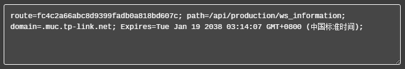

# question-nginx
some questions and answers for Nginx.

#### 1. Nginx简介？Nginx的master和worker进程分别是什么？如何实现热部署？如何实现高并发？
Nginx是一款轻量级的web服务器/反向代理服务器及电子邮件代理服务器。<br>
Nginx主要提供反向代理、负载均衡、动静分离（静态资源服务）等服务。<br>
Nginx负载均衡支持weight轮询、ip_hash、fair、url_hash四种算法。<br>
动静分离是让动态网站动态网页根据规则把不变的资源和常变的资源分开，对静态资源做缓存，即网站静态化处理。<br>

Nginx的优点：<br>
(1) 高并发、高性能（其他web服务器不具备）<br>
(2) 占用内存少，启动极快<br>
(3) 可扩展性好（模块化设计，支持第三方插件）<br>
(4) 高可靠性（持续不间断运行数年）<br>
(5) 热部署（可以在不停止服务的情况下升级Nginx）<br>
(6) BSD许可证（可以下载源码修改）<br>

Nginx的四个主要组成部分：<br>
Nginx 二进制可执行文件，由各模块源码编译出一个文件<br>
Nginx.conf 配置文件<br>
access.log 访问日志<br>
error.log 错误日志

master进程的作用是读取并验证配置文件nginx.conf；管理worker进程。<br>
每一个worker进程都维护一个线程（避免线程切换），处理连接和请求；worker进程的个数由配置文件决定，一般和CPU个数相关，有利于进程切换。<br>

所谓热部署，是指修改配置文件nginx.conf，不需要关闭nginx，不需要中断请求，就能让配置文件生效。<br>
修改配置文件后，重新生成新的worker进程，以新的配置处理请求，新的请求提交给新的worker进程，旧的worker进程等处理完请求后结束掉即可。

采用Linux的epoll模型，epoll模型基于事件驱动机制，监控多个事件是否准备完毕，如果完毕，那么放入epoll队列中，这个过程是异步的，worker进程只需要从epoll队列取出事件处理即可。

#### 2. Nginx配置ip哈希？
nginx配置ip哈希：<br>
```
ipstream simple.com {
    ip_hash;
    server 192.168.1.1;
    server 192.168.1.2;
}
```

#### 3. Nginx的主要用途？
(1) 反向代理<br>
(2) 负载均衡<br>
(3) HTTP服务器<br>
(4) 正向代理<br>

#### 4. Nginx反向代理配置？
```
server {
    listen               80;
    server_name          localhost;
    client_max_body_size 1024M;
    location {
        proxy_pass       http://localhost:8080;
        proxy_set_header Host $host:$server_port;
    }
}
```

#### 5. Nginx配置负载均衡？
一般需要同时配置反向代理。<br>
(1) 轮询
```
upstream test {
    server localhost:8080;
    server localhost:8081;
}
server {
    listen 81;
    server_name localhost;
    client_max_body_size 1024M;
    location {
        proxy_pass http://test;
        proxy_set_header Host $host:$server_port;
    }
}
```
(2) 权重
```
upstream test {
    server localhost:8080 weight=9;
    server localhost:8081 weight=1;
}
```
(3) ip_hash
```
upstream test {
    ip_hash;
    server localhost:8080;
    server localhost:8081;
}
```
(4) fair（第三方模块）。按后端服务器响应时间来分配，响应时间短的优先分配。
```
upstream backend {
    fair;
    server localhost:8080;
    server localhost:8081;
}
```
(5) url_hash（第三方模块）。每个url定向到同一个后端服务器，适用于后端服务器有缓存。
```
upstream backend {
    hash $request_url;
    hash_method crc32;
    server localhost:8080;
    server localhost:8081;
}
```
(6) 会话粘滞
```
upstream backend {
    sticky;
    server 172.19.88.84;
    server 172.19.88.93;
}
```
客户端首次发起请求，没有cookie，以轮询的方式将请求发送给后端服务器。<br>
后端服务器处理完请求后响应给nginx。<br>
nginx生成带route的cookie，返回给客户端。route的值与后端服务器对应，可能是明文、md5、sha1或hash。<br>
客户端接收到响应，保存带route的cookie。<br>
客户端再次请求，带上带route的cookie，nginx根据route转发到对应的后端服务器。<br>


#### 6. Nginx配置动静分离？
```
server {
    listen 80;
    server_name localhost;

    location / {
        root /var/www;
        index index.html;
    }

    # 所有静态请求由Nginx处理，目录为/var/www
    location ~ \.(gif|jpg|png|css|js)$ {
        root /var/www;
    }

    # 所有动态请求转发到后端处理
    location ~ \.(jsp|do)$ {
        proxy_pass http://test;
    }

    error_page 500 502 503 504 /50x.html;
    location = /50x.html {
        root /var/www;
    }
}
```

#### 7. Nginx热启动？
修改配置文件后，不用重启就能生效。
```
nginx -s reload
```

#### 8. Nginx负载均衡健康监测？
(1) 被动监测：
fail_timeout：停止分发请求至该服务器的时间
max_fails：访问失败的最大次数
```
http {
    upstream backend {
        server 192.168.1.1;
        server 192.168.1.2 max_fails=3 fail_timeout=30s;
        server 192.168.1.3 max_fails=2;
    }
    server {
        listen 80;
        location / {
            proxy_pass http://backend
        }
    }
}
```
(2) 主动监测：health_check，只有商业版支持。

#### 9. 配置应用节点超时？
```
http {
    server {
        proxy_connect_timeout 30;
        proxy_read_timeout 30;
        proxy_send_timeout 300;
    }
}
```

#### 10. 配置文件上传大小限制？
默认是1M，超出大小会报HTTP 413。
```
http {
    server {
        client_max_body_size 1024M;
    }
}
```


#### 100. question 100
#### 100. question 100
#### 100. question 100
#### 100. question 100
#### 100. question 100
#### 100. question 100
